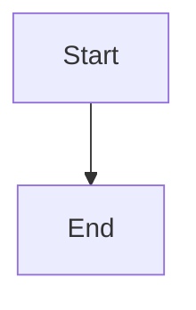

# Universal Markdown (UMD)

A next-generation Markdown parser built with Rust, combining CommonMark compliance (~75%+), Bootstrap 5 integration, semantic HTML generation, and an extensible plugin system. Maintains backward compatibility with UMD legacy syntax.

**Status**: Production-ready | **Latest Update**: February 25, 2026 | **License**: MIT

## 🧩 Philosophy

1. **Semantic-First:**
   Markdown is not just a shorthand for HTML. It is a structured document. Universal Markdown ensures every element is wrapped in semantically correct tags (e.g., using `<figure>` for code blocks) to enhance SEO and accessibility.

2. **Empowerment without Complexity:**
   Inspired by the PukiWiki legacy, we provide rich formatting (alignment, coloring, etc) without forcing users to write raw HTML. We believe in "Expressive Markdown."

3. **Universal Media Handling:**
   Redefining the standard image tag as a versatile "Media Tag." Whether it's an image, video, or audio, the parser intelligently determines the best output.

---

## Features

### Core Markdown

- ✅ **CommonMark Compliant** (~75%+ specification compliance)
- ✅ **GFM Extensions** (tables, strikethrough, task lists, footnotes)
- ✅ **HTML5 Semantic Tags** (optimized for accessibility and SEO)
- ✅ **Bootstrap 5 Integration** (automatic utility class generation)

### Media & Content

- ✅ **Auto-detect Media Files**: `` intelligently becomes `<video>`, `<audio>`, `<picture>`, or download link based on file extension
- ✅ **Semantic HTML Elements**: `&badge()`, `&ruby()`, `&sup()`, `&time()`, etc.
- ✅ **Definition Lists**: `:term|definition` syntax with block-level support
- ✅ **Code Blocks with Bootstrap Integration**: Class-based language output (`<code class="language-*">`) and syntect highlighting
- ✅ **Mermaid SSR**: ` ```mermaid ` blocks are rendered server-side as `<figure class="code-block code-block-mermaid mermaid-diagram">...<svg>...</svg></figure>`

### Tables & Layout

- ✅ **Markdown Tables**: Standard GFM tables with sorting capability
- ✅ **UMD Tables**: Extended tables with cell spanning (`|>` colspan, `|^` rowspan)
- ✅ **Cell Decoration**: alignment (LEFT/CENTER/RIGHT/JUSTIFY), color, size control
- ✅ **Block Decorations**: SIZE, COLOR, positioning with Bootstrap prefix syntax

### Interactivity & Data

- ✅ **Plugin System**: Inline (`&function(args){content};`) and block (`@function(args){{ content }}`) modes
- ✅ **Frontmatter**: YAML/TOML metadata (separate from HTML output)
- ✅ **Footnotes**: Structured data output (processed server-side by Nuxt/Laravel)
- ✅ **Custom Header IDs**: `# Header {#custom-id}` syntax

### Advanced Features

- ✅ **UMD Backward Compatibility**: Legacy PHP implementation syntax support
- ✅ **Block Quotes**: UMD format `> ... <` + Markdown `>` prefix
- ✅ **Discord-style Spoilers**: `||hidden text||` syntax
- ✅ **Underline & Emphasis Variants**: Both semantic (`**bold**`, `*italic*`) and visual (`''bold''`, `'''italic'''`)

### Security

- ✅ **XSS Protection**: Input HTML fully escaped, user input never directly embedded
- ✅ **URL Sanitization**: Blocks dangerous schemes (`javascript:`, `data:`, `vbscript:`, `file:`)
- ✅ **Safe Link Handling**: `<URL>` explicit markup only (bare URLs not auto-linked)

### Platform Support

- ✅ **WebAssembly (WASM)**: Browser-side rendering via `wasm-bindgen`
- ✅ **Server-side Rendering**: Rust library for backend integration (Nuxt, Laravel, etc.)

### Mermaid Example

Input:

````markdown

````

Output (excerpt):

```html
<figure
  class="code-block code-block-mermaid mermaid-diagram"
  data-mermaid-source="flowchart TD..."
>
  <svg><!-- rendered by mermaid-rs-renderer --></svg>
</figure>
```

### Syntax Highlight Example

Input:

````markdown
```rust
fn main() {
        println!("hello");
}
```
````

Output (excerpt):

```html
<pre><code class="language-rust syntect-highlight" data-highlighted="true"><span class="syntect-source syntect-rust">...</span></code></pre>
```

### Code Block Specification

UMD code blocks use a Rust-first hybrid strategy with frontend fallback.

#### Output Rules

- `pre` never gets a `lang` attribute
- Language is represented as `class="language-xxx"` on `<code>`
- If Syntect highlights on server side:
  - `class="language-xxx syntect-highlight"`
  - `data-highlighted="true"` is added
- If language is not supported by Syntect:
  - Keep `class="language-xxx"` and let frontend highlighter process it
- `mermaid` is handled separately and rendered as SVG `<figure class="... mermaid-diagram">`

#### Processing Flow

```mermaid
flowchart TD
    A[Fenced code block] --> B[comrak emits code class=language-xxx]
    B --> C{language == mermaid}
    C -->|Yes| D[Rust renders Mermaid SVG]
    D --> E[figure.mermaid-diagram output]
    C -->|No| F{Syntect supports language?}
    F -->|Yes| G[Rust highlighted HTML]
    G --> H[code.language-xxx.syntect-highlight + data-highlighted=true]
    F -->|No| I[code.language-xxx (fallback)]
    H --> J[skip client-side re-highlight]
    I --> K[Prism/Highlight.js/Shiki can process]
```

#### Frontend Integration Rule

Use selectors that exclude server-highlighted code blocks:

```javascript
document
  .querySelectorAll(
    'pre code[class*="language-"]:not([data-highlighted="true"])',
  )
  .forEach((el) => Prism.highlightElement(el));
```

This prevents double-highlighting and keeps Mermaid processing isolated.

---

## Getting Started

### Rust Library

Add to your `Cargo.toml`:

```toml
[dependencies]
umd = { path = "./umd", version = "0.1" }
```

### Basic Usage

```rust
use umd::parse;

fn main() {
    let input = "# Hello World\n\nThis is **bold** text.";
    let html = parse(input);
    println!("{}", html);
    // Output: <h1>Hello World</h1><p>This is <strong>bold</strong> text.</p>
}
```

### With Frontmatter

```rust
use umd::parse_with_frontmatter;

fn main() {
    let input = r#"---
title: My Document
author: Jane Doe
---

# Content starts here"#;

    let result = parse_with_frontmatter(input);
    println!("Title: {}", result.frontmatter.as_ref().map(|fm| &fm.content).unwrap_or(&"".to_string()));
    println!("HTML: {}", result.html);
}
```

### WebAssembly (Browser)

Build WASM module:

```bash
./build.sh release
# Output: pkg/umd.js, pkg/umd_bg.wasm
```

Use in JavaScript:

```javascript
import init, { parse_markdown } from "./pkg/umd.js";

async function main() {
  await init();
  const html = parse_markdown("# Hello from WASM");
  console.log(html);
}

main();
```

---

## Syntax Examples

### Media Auto-detection

```markdown
 → <video controls><source src="demo.mp4" type="video/mp4" />...</video>
 → <audio controls><source src="bg.mp3" type="audio/mpeg" />...</audio>
 → <picture><source srcset="screen.png" type="image/png" /></picture>
 → <a href="file.pdf" download>📄 file.pdf</a>
```

### Block Decorations

```markdown
COLOR(red): Error message → <p class="text-danger">Error message</p>
SIZE(1.5): Larger text → <p class="fs-4">Larger text</p>
RIGHT: Right-aligned content → <p class="text-end">Right-aligned content</p>
CENTER: Centered paragraph → <p class="text-center">Centered paragraph</p>
```

### Inline Semantic Elements

```markdown
&badge(success){Active}; → <span class="badge bg-success">Active</span>
&ruby(reading){漢字}; → <ruby>漢字<rp>(</rp><rt>reading</rt><rp>)</rp></ruby>
&sup(superscript); → <sup>superscript</sup>
&time(2026-02-25){Today}; → <time datetime="2026-02-25">Today</time>
```

### Plugins

```umd
&highlight(yellow){Important text}; → <template class="umd-plugin umd-plugin-highlight">
<data value="0">yellow</data>
Important text
</template>

@detail(Click to expand){{Hidden}} → <template class="umd-plugin umd-plugin-detail">
<data value="0">Click to expand</data>
Hidden
</template>
```

### Tables with Cell Spanning

```umd
UMD Table (with colspan/rowspan):

| Header1 |>      | Header3 |
| Cell1   | Cell2 | Cell3 |
|^        | Cell4 | Cell5 |

RIGHT:
| Left Cell | Right Cell |

CENTER:
| Centered Table |
```

---

## Documentation

- **[docs/README.md](docs/README.md)** - Documentation index (entry point)
- **[docs/architecture.md](docs/architecture.md)** - System architecture, processing pipeline, component details, developer guide
- **[docs/implemented-features.md](docs/implemented-features.md)** - Complete reference of implemented features
- **[docs/planned-features.md](docs/planned-features.md)** - Roadmap for planned features
- **[PLAN.md](PLAN.md)** - Implementation status and milestone tracking
- **[.github/copilot-instructions.md](.github/copilot-instructions.md)** - AI agent quick reference for development

---

## Architecture Overview

```text
Input Text
    ↓
[Frontmatter Extractor] ← Extract YAML/TOML metadata
    ↓
[Nested Blocks Preprocess] ← Normalize list-item nested blocks
    ↓
[Tasklist Preprocess]   ← Convert indeterminate markers
    ↓
[Underline Preprocess]  ← Protect Discord-style __text__
    ↓
[Conflict Resolver]     ← Protect UMD syntax with markers
    ↓
[HTML Sanitizer]        ← Escape user input, preserve entities
    ↓
[comrak Parser]         ← CommonMark + GFM AST generation
    ↓
[Underline Postprocess] ← Restore <u> tags
    ↓
[UMD Extensions]        ← Apply inline/block decorations, plugins, tables, media
    ↓
[Footnotes Extractor]   ← Split body HTML and footnotes section
    ↓
Output: HTML + Frontmatter + Footnotes
```

### Key Components

- **[src/lib.rs](src/lib.rs)** - Main entry point (`parse()`, `parse_with_frontmatter()`)
- **[src/parser.rs](src/parser.rs)** - CommonMark + GFM parsing (comrak wrapper)
- **[src/sanitizer.rs](src/sanitizer.rs)** - HTML escaping & XSS protection
- **[src/frontmatter.rs](src/frontmatter.rs)** - YAML/TOML metadata extraction
- **[src/extensions/](src/extensions/)** - UMD syntax implementations
  - `conflict_resolver.rs` - Marker-based pre/post-processing
  - `block_decorations.rs` - COLOR, SIZE, alignment prefixes
  - `inline_decorations.rs` - Semantic element functions
  - `plugins.rs` - Plugin rendering system
  - `table/` - Table parsing & decoration
  - `media.rs` - Media auto-detection

---

## Test Coverage

**284 tests passing** ✅

```text
196 unit tests (core modules)
 24 bootstrap integration tests (CSS class generation)
 18 commonmark compliance tests (specification adherence)
 13 conflict resolution tests (syntax collision handling)
  1 semantic integration test
```

Run tests:

```bash
cargo test --verbose              # All tests
cargo test --test bootstrap_integration  # Integration tests only
```

---

## Performance

- **Small documents** (1KB): < 1ms
- **Medium documents** (10KB): < 10ms
- **Large documents** (100KB): < 100ms

(Benchmarks on modern hardware)

---

## Security Considerations

- ✅ **Input Sanitization**: All user input HTML-escaped before parsing
- ✅ **Scheme Blocklist**: Dangerous URL schemes blocked (`javascript:`, `data:`, etc.)
- ✅ **Plugin Safety**: Plugins output to `<template>` for server-side processing (no direct HTML execution)
- ⚠️ **XSS Risk Mitigation**: Recommend server-side validation of plugin content before rendering

---

## Compatibility

- **Rust**: 1.93.1+ (Edition 2024)
- **WASM**: wasm32-unknown-unknown target
- **Node.js**: Via WASM bindings
- **Browser**: Chrome, Firefox, Safari, Edge (ES2020+)

---

## Built With

- **comrak** 0.50.0 - CommonMark + GFM parser
- **ammonia** 4.1.2 - HTML sanitization
- **maud** 0.27.0 - Type-safe HTML generation
- **regex** 1.12.2 - Pattern matching
- **wasm-bindgen** 0.2.108 - WASM integration

---

## Contributing

Contributions welcome! Please:

1. Read [docs/architecture.md](docs/architecture.md) for system design
2. Check [PLAN.md](PLAN.md) for current priorities
3. Write tests for new features
4. Ensure all tests pass: `cargo test --verbose`
5. Follow Rust conventions and document your changes

---

## License

MIT License - see [LICENSE](LICENSE) for details
