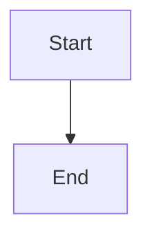
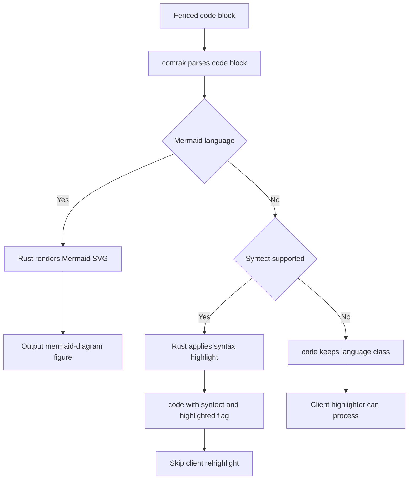

# Universal Markdown (UMD)

A next-generation Markdown parser built with Rust, combining CommonMark compliance (~75%+), semantic HTML generation, a minimal `umd-*` reference CSS (no required framework dependency), and an extensible plugin system. Maintains backward compatibility with UMD legacy syntax.

**Status**: Production-ready | **Latest Update**: 2026-05-19 | **License**: Apache-2.0

## 🧩 Philosophy

1. **Semantic-First:**
   Markdown is not just a shorthand for HTML. It is a structured document. Universal Markdown ensures every element is wrapped in semantically correct tags (e.g., using `<figure>` for code blocks) to enhance SEO and accessibility.

2. **Empowerment without Complexity:**
   Inspired by the PukiWiki legacy, we provide rich formatting (alignment, coloring, etc) without forcing users to write raw HTML. We believe in "Expressive Markdown."

3. **Universal Media Handling:**
   Redefining the standard image tag as a versatile "Media Tag." Whether it's an image, video, or audio, the parser intelligently determines the best output.

[See also (Japanese)](https://qiita.com/logue/items/244d6d31a63e3509418f)

---

## Features

## Browser Support Policy

umd-core targets evergreen browsers only.
Backward compatibility is the responsibility of the
consuming application, not this library.

Minimum requirements:

- CSS Layers (@layer) support
- CSS Custom Properties support
- WASM support

### Core Markdown

- ✅ **CommonMark Compliant** (~75%+ specification compliance)
- ✅ **GFM Extensions** (tables, strikethrough, task lists, footnotes)
- ✅ **HTML5 Semantic Tags** (optimized for accessibility and SEO)
- ✅ **Reference CSS** (`umd-*` utility classes, no required framework dependency — see [docs/reference-css.md](docs/reference-css.md))

### Media & Content

- ✅ **Auto-detect Media Files**: `` intelligently becomes `<video>`, `<audio>`, `<picture>`, or download link based on file extension
- ✅ **Semantic HTML Elements**: `&ruby()`, `&sup()`, `&time()`, etc.
- ✅ **Definition Lists**: `:term|definition` syntax with block-level support
- ✅ **Code Blocks**: Class-based language output (`<code class="language-*">`) and syntect highlighting
- ✅ **Mermaid SSR**: ` ```mermaid ` blocks are rendered server-side as `<figure class="umd-code-block umd-code-block-mermaid umd-mermaid-diagram">...<svg>...</svg></figure>`

### Tables & Layout

- ✅ **Markdown Tables**: Standard GFM tables (`<table class="umd-list-table">` — horizontal row dividers only, no vertical lines)
- ✅ **UMD Tables**: PukiWiki-style tables with cell spanning (`|>` colspan, `|^` rowspan) (`<table class="umd-table">` — full grid, vertical + horizontal dividers)
- ✅ **Cell Decoration**: logical-direction alignment (`START`/`CENTER`/`END`/`JUSTIFY`, `V-START`/`V-CENTER`/`V-END`/`BASELINE`), color, size control
- ✅ **Block Decorations**: SIZE, COLOR, logical-direction positioning prefixes (`START`/`END`/`V-START`/etc.)

### Interactivity & Data

- ✅ **Plugin System**: Inline (`&function(args){content};`) and block (`@function(args){{ content }}`) modes
- ✅ **Frontmatter**: YAML/TOML metadata (separate from HTML output)
- ✅ **Footnotes**: Footnotes section is separated from body HTML in `ParseResult` and can be rendered server-side
- ✅ **Custom Header IDs**: `# Header {#custom-id}` syntax

### Advanced Features

- ✅ **UMD Backward Compatibility**: Legacy PHP implementation syntax support
- ✅ **Block Quotes**: UMD format `> ... <` + Markdown `>` prefix
- ✅ **Discord-style Spoilers**: `||hidden text||` syntax
- ✅ **Underline & Emphasis Variants**: Both semantic (`**bold**`, `*italic*`) and visual (`''bold''`, `'''italic'''`)

### Security

- ✅ **XSS Protection**: Input HTML fully escaped, user input never directly embedded
- ✅ **URL Sanitization**: Blocks dangerous schemes (`javascript:`, `data:`, `vbscript:`, `file:`)
- ✅ **Invisible Character Sanitization**: Removes disallowed invisible blank-like chars (`U+200B`, `U+200C`, `U+200D`, `U+FEFF`, `U+3164`) and BiDi control chars (`U+202A`-`U+202E`, `U+2066`-`U+2069`) from text/URL input
- ✅ **ASCII Control Character Removal**: Strips C0 control characters (`U+0000`–`U+001F` except TAB/LF/CR) and DEL (`U+007F`) from non-code-block regions of the source. Content inside fenced code blocks (` ``` ` / `~~~`) is exempt. Plugin content is the **plugin author's responsibility** to sanitize.
- ✅ **Allowed Blank Characters**: Only half-width space (`U+0020`) and full-width space (`U+3000`) are preserved
- ✅ **Safe Link Handling**: `<URL>` explicit markup only (bare URLs not auto-linked)
- ✅ **IDN Visual Warning**: External `http/https` links with non-ASCII or punycode hosts get a warning marker (`class="umd-idn-warning-link"`, `data-idn-warning="true"`) and an inline warning icon
- ✅ **Inline Nesting Depth Limit**: Inline decoration functions (`&color()`, `&size()`, `&ruby()`, etc.) are limited in nesting depth (default: 5). Over-limit blocks are not expanded and are wrapped in `<span class="umd-error-deep-recursive">` for visual identification. Plugin names (`&fn()`) are **not** counted toward the limit.

Example CSS (minimal):

```css
a.umd-idn-warning-link {
  text-decoration-thickness: 2px;
}

.umd-idn-warning-icon {
  display: inline-block;
  margin-left: 0.35em;
  font-size: 0.9em;
  line-height: 1;
  color: #b45309;
  vertical-align: text-top;
}

/* Visualize over-limit inline decorations in development */
.umd-error-deep-recursive {
  outline: 2px dashed red;
  background-color: rgba(255, 0, 0, 0.05);
}
```

### Platform Support

- ✅ **WebAssembly (WASM)**: Browser-side rendering via `wasm-bindgen`
- ✅ **Server-side Rendering**: Rust library for backend integration (Nuxt, Laravel, etc.)

### Mermaid Example

Input:

````markdown

```mermaid
flowchart TD
    A[Start] --> B[End]
```
````

Output (excerpt):

```html
<figure
  class="code-block code-block-mermaid mermaid-diagram"
  data-mermaid-source="flowchart TD..."
>
  <svg><!-- rendered by mermaid-rs-renderer --></svg>
</figure>
```

### Syntax Highlight Example

Input:

````markdown
```rust
fn main() {
        println!("hello");
}
```
````

Output (excerpt):

```html
<pre><code class="language-rust syntect-highlight" data-highlighted="true"><span class="syntect-source syntect-rust">...</span></code></pre>
```

### Code Block Specification

UMD code blocks use a Rust-first hybrid strategy with frontend fallback.

#### Output Rules

- `pre` never gets a `lang` attribute
- Language is represented as `class="language-xxx"` on `<code>`
- If Syntect highlights on server side:
  - `class="language-xxx syntect-highlight"`
  - `data-highlighted="true"` is added
- If language is not supported by Syntect:
  - Keep `class="language-xxx"` and let frontend highlighter process it
- `mermaid` is handled separately and rendered as SVG `<figure class="... mermaid-diagram">`

#### Processing Flow


```mermaid
flowchart TD
  A[Fenced code block] --> B[comrak parses code block]
  B --> C{Mermaid language}
  C -->|Yes| D[Rust renders Mermaid SVG]
  D --> E[Output mermaid-diagram figure]
  C -->|No| F{Syntect supported}
  F -->|Yes| G[Rust applies syntax highlight]
  G --> H[code with syntect and highlighted flag]
  F -->|No| I[code keeps language class]
  H --> J[Skip client rehighlight]
  I --> K[Client highlighter can process]
```

#### Frontend Integration Rule

Use selectors that exclude server-highlighted code blocks:

```javascript
document
  .querySelectorAll(
    'pre code[class*="language-"]:not([data-highlighted="true"])',
  )
  .forEach((el) => Prism.highlightElement(el));
```

This prevents double-highlighting and keeps Mermaid processing isolated.

---

## Getting Started

### Rust Library

Add to your `Cargo.toml`:

```toml
[dependencies]
umd = { path = "./umd", version = "0.1.1" }
```

### Basic Usage

```rust
use umd::parse;

fn main() {
    let input = "# Hello World\n\nThis is **bold** text.";
    let html = parse(input);
    println!("{}", html);
    // Output: <h1>Hello World</h1><p>This is <strong>bold</strong> text.</p>
}
```

### With Frontmatter

```rust
use umd::parse_with_frontmatter;

fn main() {
    let input = r#"---
title: My Document
author: Jane Doe
---

# Content starts here"#;

    let result = parse_with_frontmatter(input);
    println!("Title: {}", result.frontmatter.as_ref().map(|fm| &fm.content).unwrap_or(&"".to_string()));
    println!("HTML: {}", result.html);
}
```

### WebAssembly (Browser)

Build WASM module:

```bash
./build.sh release
# Output: dist/umd.js, dist/umd_bg.wasm
```

Use in JavaScript:

```javascript
import init, { parse } from "./dist/umd.js";

async function main() {
  await init();
  const html = parse("# Hello from WASM");
  const htmlWithOptions = parse(
    "[Guide](/docs)",
    JSON.stringify({
      baseUrl: "/app",
      allowFragmentExtensionHint: true,
      icons: {
        colorSwatch:
          '<iconify-icon icon="ic:baseline-colorize" aria-hidden="true"></iconify-icon>',
      },
    }),
  );
  console.log(html);
  console.log(htmlWithOptions);
}

main();
```

### Icons

Every icon umd-core generates — media fallback links (`video`, `audio`,
`download`), the inline color swatch (`colorSwatch`), and each `> [!NOTE]`-style
callout (`note`, `tip`, `important`, `warning`, `caution`, `must`, `recommend`,
`dont`, `never`, `example`) — is plain HTML configured through
`ParserOptions.icons` (Rust) / the `icons` object in the JSON options (WASM),
exactly like `colorSwatch` above.

- **Default icon system**: [Iconify](https://iconify.design/)'s
  [`<iconify-icon>`](https://iconify.design/docs/iconify-icon/) web component,
  using Google's Material Icons set (`ic:` prefix) — e.g.
  `<iconify-icon icon="ic:baseline-warning"></iconify-icon>`.
- **A script is required to render them**: umd-core only emits the
  `<iconify-icon>` markup; it does not bundle or load any JavaScript itself.
  The host application must include the Iconify Icon script (e.g.
  `<script src="https://code.iconify.design/iconify-icon/2.x/iconify-icon.min.js"></script>`
  or the `iconify-icon` npm package) for icons to actually render — the same
  responsibility the previous Bootstrap Icons defaults placed on the host app.
- **Fully replaceable**: every field is a raw HTML string inserted verbatim,
  so if Iconify/Material Icons don't fit your app, override any or all of
  them with Bootstrap Icons, Font Awesome, an inline `<svg>`, or anything
  else — see `Icons::default()` in `src/parser.rs` for the full field list
  and default values.

---

## Syntax Examples

### Media Auto-detection

```markdown
 → <video controls><source src="demo.mp4" type="video/mp4" />...</video>
 → <audio controls><source src="bg.mp3" type="audio/mpeg" />...</audio>
 → <picture><source srcset="screen.png" type="image/png" /></picture>
 → <a href="file.pdf" download><iconify-icon icon="ic:baseline-file-download"></iconify-icon> file.pdf</a>
```

### Block Decorations

```markdown
COLOR(red): Error message → <p class="umd-color-red">Error message</p>
SIZE(lg): Larger text → <p class="umd-text-size-lg">Larger text</p>
END: End-aligned content → <p class="umd-end">End-aligned content</p>
CENTER: Centered paragraph → <p class="umd-center">Centered paragraph</p>
V-START: Top-aligned cell content → <p class="umd-v-start">Top-aligned cell content</p>
```

`SIZE()` only accepts the keyword sizes `xs`/`sm`/`lg`/`xl` by default; enable
`ParserOptions.allow_custom_font_size` to also allow arbitrary rem/px values
(rendered as an inline style instead of a class).

Alignment uses logical-direction keywords (`START`/`END`, `V-START`/
`V-CENTER`/`V-END`/`BASELINE`) rather than physical ones (`LEFT`/`RIGHT`/
`TOP`/`BOTTOM`), so they flip correctly under `dir="rtl"` or vertical writing
modes. This applies uniformly across paragraph alignment, table cell
alignment, and the table/plugin block-placement prefix (see
[Tables with Cell Spanning](#tables-with-cell-spanning) below) — there's no
physical `LEFT`/`RIGHT`/`TOP`/`BOTTOM` left anywhere in this syntax family.

### Inline Semantic Elements

```markdown
&ruby(reading){漢字}; → <ruby>漢字<rp>(</rp><rt>reading</rt><rp>)</rp></ruby>
&sup(superscript); → <sup>superscript</sup>
&time(2026-02-25){Today}; → <time datetime="2026-02-25">Today</time>
```

### Inline Code Color Swatch

```markdown
`#ffce44`
`rgb(255,0,0)`
`rgba(0,255,0,0.4)`
`hsl(100, 10%, 10%)`
`hsla(100, 24%, 40%, 0.5)`
```

```html
<code
  >#ffce44<span
    class="inline-code-color"
    style="background-color: #ffce44;"
  ></span
></code>
<code
  >rgb(255,0,0)<span
    class="inline-code-color"
    style="background-color: rgb(255,0,0);"
  ></span
></code>
<code
  >rgba(0,255,0,0.4)<span
    class="inline-code-color"
    style="background-color: rgba(0,255,0,0.4);"
  ></span
></code>
<code
  >hsl(100, 10%, 10%)<span
    class="inline-code-color"
    style="background-color: hsl(100, 10%, 10%);"
  ></span
></code>
<code
  >hsla(100, 24%, 40%, 0.5)<span
    class="inline-code-color"
    style="background-color: hsla(100, 24%, 40%, 0.5);"
  ></span
></code>
```

Recommended CSS:

```css
code .inline-code-color {
  display: inline-block;
  width: 0.75em;
  height: 0.75em;
  margin-left: 0.4em;
  border-radius: 0.2em;
  border: 1px solid rgba(0, 0, 0, 0.2);
  vertical-align: middle;
}
```

### Plugins

```umd
&badge(primary){New};
@card(info){{
  **Markdown** content
}}
```

Output (example):

```html
<template class="umd-plugin umd-plugin-badge">
  <data value="0">primary</data>
  New
</template>
<template class="umd-plugin umd-plugin-card">
  <data value="0">info</data>
  **Markdown** content
</template>
```

Standard plugins may output direct HTML instead of `<template>`:

```umd
@detail(Click to expand, open){{
  Hidden content
}}
@clear()
```

```html
<details open>
  <summary>Click to expand</summary>
  Hidden content
</details>
<div class="clearfix"></div>
```

TypeScript parsing snippet:

```ts
const doc = new DOMParser().parseFromString(html, "text/html");
const plugins = [...doc.querySelectorAll("template.umd-plugin")].map((tpl) => {
  const cls = tpl.getAttribute("class") ?? "";
  const name =
    cls
      .split(/\s+/)
      .find((c) => c.startsWith("umd-plugin-") && c !== "umd-plugin")
      ?.replace("umd-plugin-", "") ?? "unknown";
  const args = [...tpl.content.querySelectorAll("data[value]")]
    .sort(
      (a, b) =>
        Number(a.getAttribute("value")) - Number(b.getAttribute("value")),
    )
    .map((n) => n.textContent ?? "");
  return { name, args };
});
```

PHP parsing snippet:

```php
$doc = new DOMDocument();
@$doc->loadHTML($html, LIBXML_HTML_NOIMPLIED | LIBXML_HTML_NODEFDTD);
$xp = new DOMXPath($doc);
$nodes = $xp->query("//template[contains(concat(' ', normalize-space(@class), ' '), ' umd-plugin ')]");
foreach ($nodes as $tpl) {
    // read class="umd-plugin umd-plugin-..." and child <data value="...">
}
```

See full examples: [`docs/plugin-system.md`](docs/plugin-system.md)

### Tables with Cell Spanning

```umd
UMD Table (with colspan/rowspan):

| Header1 |>      | Header3 |
| Cell1   | Cell2 | Cell3 |
|^        | Cell4 | Cell5 |

END:
| Left Cell | Right Cell |

CENTER:
| Centered Table |
```

---

## Documentation

- **[docs/README.md](docs/README.md)** - Documentation index (entry point)
- **[docs/architecture.md](docs/architecture.md)** - System architecture, processing pipeline, component details, developer guide
- **[docs/implemented-features.md](docs/implemented-features.md)** - Complete reference of implemented features
- **[docs/planned-features.md](docs/planned-features.md)** - Roadmap for planned features
- **[PLAN.md](PLAN.md)** - Implementation status and milestone tracking
- **[.github/copilot-instructions.md](.github/copilot-instructions.md)** - AI agent quick reference for development

## Publishing & Maintenance

- **[PUBLISHING.md](PUBLISHING.md)** - crates.io publishing checklist and commands
- **[RELEASE.md](RELEASE.md)** - SemVer and release operation guide
- **[CHANGELOG.md](CHANGELOG.md)** - Project change history
- **[SECURITY.md](SECURITY.md)** - Vulnerability reporting policy

---

## Architecture Overview

```text
Input Text
    ↓
[Frontmatter Extractor] ← Extract YAML/TOML metadata
    ↓
[Nested Blocks Preprocess] ← Normalize list-item nested blocks
    ↓
[Tasklist Preprocess]   ← Convert indeterminate markers
    ↓
[Underline Preprocess]  ← Protect Discord-style __text__
    ↓
[Conflict Resolver]     ← Protect UMD syntax with markers
    ↓
[HTML Sanitizer]        ← Escape user input, preserve entities
    ↓
[comrak Parser]         ← CommonMark + GFM AST generation
    ↓
[Underline Postprocess] ← Restore <u> tags
    ↓
[UMD Extensions]        ← Apply inline/block decorations, plugins, tables, media
    ↓
[Footnotes Extractor]   ← Split body HTML and footnotes section
    ↓
Output: HTML + Frontmatter + Footnotes
```

### Key Components

- **[src/lib.rs](src/lib.rs)** - Main entry point (`parse()`, `parse_with_frontmatter()`)
- **[src/parser.rs](src/parser.rs)** - CommonMark + GFM parsing (comrak wrapper)
- **[src/sanitizer.rs](src/sanitizer.rs)** - HTML escaping & XSS protection
- **[src/frontmatter.rs](src/frontmatter.rs)** - YAML/TOML metadata extraction
- **[src/extensions/](src/extensions/)** - UMD syntax implementations
  - `conflict_resolver.rs` - Marker-based pre/post-processing
  - `block_decorations.rs` - COLOR, SIZE, alignment prefixes
  - `inline_decorations.rs` - Semantic element functions
  - `plugins.rs` - Plugin rendering system
  - `table/` - Table parsing & decoration
  - `media.rs` - Media auto-detection

---

## Test Coverage

**358 tests passing** (plus 15 doc tests) ✅

```text
243 unit tests (core modules)
 47 CSS class / HTML output integration tests (tests/bootstrap_integration.rs)
 21 conflict resolution tests (syntax collision handling)
 18 commonmark compliance tests (specification adherence)
 14 comment syntax tests
 11 base URL resolution tests
  3 bidi code block option tests
  1 semantic integration test
```

> Note: `tests/bootstrap_integration.rs` predates the move away from Bootstrap
> utility classes; despite the filename, it only asserts UMD's own `umd-*`
> reference-CSS classes.

Run tests:

```bash
cargo test --verbose                     # All tests
cargo test --test bootstrap_integration  # CSS class / HTML output tests only
```

---

## Performance

- **Small documents** (1KB): < 1ms
- **Medium documents** (10KB): < 10ms
- **Large documents** (100KB): < 100ms

(Benchmarks on modern hardware)

---

## Security Considerations

- ✅ **Input Sanitization**: All user input HTML-escaped before parsing
- ✅ **Scheme Blocklist**: Dangerous URL schemes blocked (`javascript:`, `data:`, etc.)
- ✅ **Invisible Character Removal**: `U+200B`, `U+200C`, `U+200D`, `U+FEFF`, `U+3164`, `U+202A`-`U+202E`, and `U+2066`-`U+2069` are removed during sanitization
- ✅ **Allowed Spaces Policy**: Only `U+0020` (half-width space) and `U+3000` (full-width space) are treated as allowed blank characters
- ✅ **Directional Text Guidance**: For BiDi presentation, use UMD syntax (`&bdi(text);`, `&bdo(ltr){text};`, `&bdo(rtl){text};`) instead of raw BiDi control characters
- ✅ **Homograph Visual Warning**: External `http/https` links with non-ASCII or punycode hosts are marked with IDN warning attributes and icon (visual warning, not blocked)
- ✅ **ASCII Control Character Removal**: C0 controls (except TAB/LF/CR) and DEL are stripped from document text. Content inside fenced code blocks is exempt.
- ✅ **Plugin Safety**: Plugins output to `<template>` for server-side processing (no direct HTML execution). Plugin content sanitization is the **plugin author's responsibility**.
- ✅ **Inline Nesting Depth Limit**: Protects against deeply-nested inline decoration abuse. Over-limit blocks are rendered as `<span class="umd-error-deep-recursive">` (unprocessed, escaped). Default limit is 5; configurable via `maxInlineNesting` option (recommended: 3–5).
- ⚠️ **XSS Risk Mitigation**: Recommend server-side validation of plugin content before rendering

---

## Compatibility

- **Rust**: 1.93.1+ (Edition 2024)
- **WASM**: wasm32-unknown-unknown target
- **Node.js**: Via WASM bindings
- **Browser**: Chrome, Firefox, Safari, Edge (ES2020+)

---

## Built With

- **comrak** 0.52.0 - CommonMark + GFM parser
- **ammonia** 4.1.2 - HTML sanitization
- **maud** 0.27.0 - Type-safe HTML generation
- **regex** 1.12.3 - Pattern matching
- **wasm-bindgen** 0.2.120 - WASM integration

---

## Contributing

Contributions welcome! Please:

1. Read [docs/architecture.md](docs/architecture.md) for system design
2. Check [PLAN.md](PLAN.md) for current priorities
3. Write tests for new features
4. Ensure all tests pass: `cargo test --verbose`
5. Follow Rust conventions and document your changes

---

## License

Apache License 2.0 - see [LICENSE](LICENSE) for details

## 🎨 Crafted for Developers

This template is built with a focus on **UI/UX excellence** and **modern developer experience**. Maintaining it involves constant testing and updates to ensure everything works seamlessly.

If you appreciate the attention to detail in this project, a small sponsorship would go a long way in supporting my work across the Vue.js and Metaverse ecosystems.

[](https://github.com/sponsors/logue)
