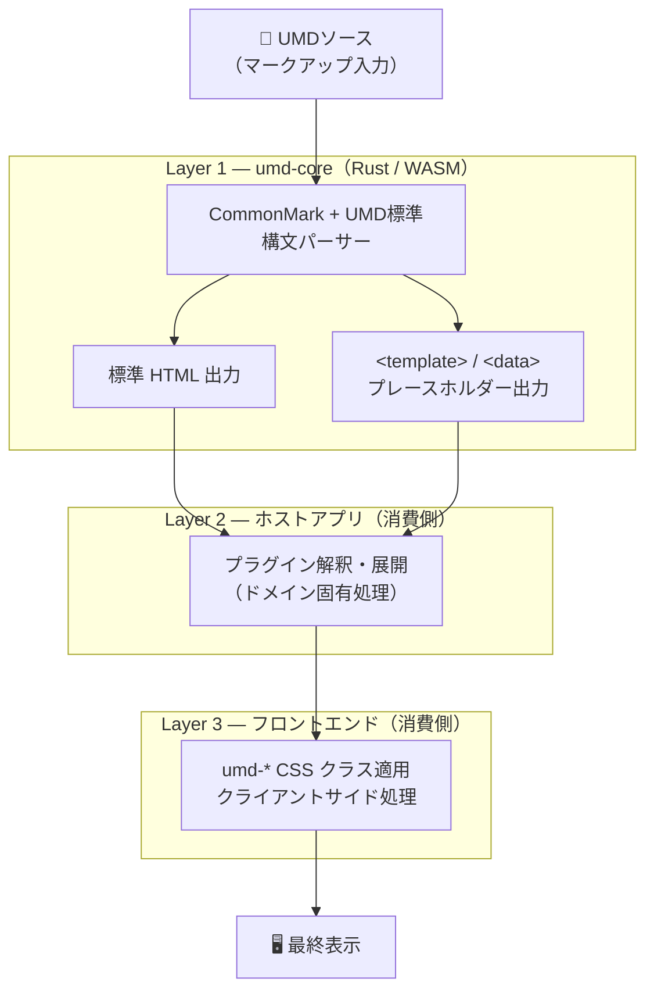

# アーキテクチャドキュメント

**最終更新**: 2026年9月9日

Universal Markdownの技術アーキテクチャとシステム設計を記載しています。

## 目次

- [システム概要](#システム概要)
- [3層アーキテクチャ（遅延レンダリングモデル）](#3層アーキテクチャ遅延レンダリングモデル)
- [処理フロー](#処理フロー)
- [主要コンポーネント](#主要コンポーネント)
- [依存クレート](#依存クレート)
- [ディレクトリ構造](#ディレクトリ構造)
- [開発者向けガイド](#開発者向けガイド)
- [構文優先順位ポリシー](#構文優先順位ポリシー)
- [セキュリティ方針](#セキュリティ方針)

---

## システム概要

Universal Markdownは、CommonMark準拠のMarkdownパーサーをベースに、UMD（Universal Markdown）独自構文、セマンティックHTML生成を実現するRust製パーサーライブラリです。

### 設計方針

1. **CommonMark準拠**: 75%以上のCommonMark仕様テストをパス
2. **セキュリティ優先**: HTML直接入力を禁止、全てのユーザー入力をエスケープ
3. **拡張性**: プラグインシステムによる機能拡張が可能
4. **セマンティックHTML**: アクセシビリティとSEOを考慮したHTML出力
5. **表記の一意性**: 複数の書き方に同じ意味を持たせない。標準Markdownでは
   `**text**` と `__text__` はどちらも `<strong>` に変換されるが、UMDでは
   両者を明確に区別し、`**text**` は強調 (`<strong>`)、`__text__` は
   Discord風の下線 (`<u>`) として扱う。同じ意味を表す構文を複数用意すると
   利用者・実装者双方の判断コストが増え、パーサーの優先順位ルールも複雑化
   するため、UMD独自構文を追加する際は既存の構文と意味が重複しないように
   設計する（詳細は[構文優先順位ポリシー](#構文優先順位ポリシー)を参照）。

### 技術スタック

- **言語**: Rust 1.95.0 (Edition 2024)
- **ベースパーサー**: comrak 0.52.0 (GFM準拠ASTベース)
- **HTML生成**: maud 0.27.0 (型安全)
- **HTML安全化**: ammonia 4.1.2
- **正規表現**: regex 1.12.3
- **WASM対応**: wasm-bindgen 0.2.120

---

## 3層アーキテクチャ（遅延レンダリングモデル）

umd-core は「**コアはプラグインの意味を知る必要がない**」という原則に基づき、処理を3層に分離する **遅延レンダリング（Deferred Rendering）** パターンを採用しています。



### 各層の責務

| 層 | 担当 | 責務の範囲 |
|----|------|------------|
| **Layer 1: umd-core** | このリポジトリ | CommonMark + UMD標準構文のパース。プラグイン構文を `<template>`/`<data>` タグに変換して出力する。プラグインの「意味」は関知しない |
| **Layer 2: ホストアプリ** | 利用側 | `<template>`/`<data>` タグを解釈し、実際のHTMLへ展開する。ドメイン固有のプラグインをここで実装する |
| **Layer 3: フロントエンド** | 利用側 | `umd-*` CSSクラスの適用、クライアントサイドのインタラクション処理 |

### コアに含めるかどうかの判断基準

**コアに含める**: CommonMark仕様に準拠した構文、またはUMDがすべてのユースケースで標準化するインライン/ブロック構文

**ホスト/フロントエンドの責務**: ドメイン固有の処理、プラグインの具体的な意味解釈、ビジュアル表現の詳細

迷ったときの指針：「その構文の意味が *誰がUMDを使っているか* によって変わるなら、コアの外に置く」

### `<template>`/`<data>` プレースホルダー

umd-core がパース時に意味を解決できないプラグイン構文は、`<template>` または `<data>` タグとして出力されます。

```html
<!-- 入力: &myplugin(arg){content} -->
<!-- umd-core の出力: -->
<template data-plugin="myplugin" data-arg="arg">content</template>
```

これにより：

- ホストがプラグインを実装していなくても**ページが破損しない**（ブラウザはタグを無視する）
- コアを変更せずにホスト固有のレンダリングを実現できる
- フロントエンドのみで完結するプラグインも実装可能

### PukiWiki との設計上の違い

PukiWikiはプラグインがHTMLを直接生成する（コア本体にPHPコードを挿入する）モデルでした。umd-coreはこれを逆転させ、プラグインの実装をコアの外に追い出し、意味的に中立なプレースホルダーを介して通信します。

| | PukiWiki | umd-core |
|--|----------|----------|
| プラグインの実装場所 | コア本体（PHP直挿入） | ホスト/フロントエンド |
| プラグインのHTML生成 | プラグイン自身が行う | ホストがプレースホルダーを解釈して行う |
| コアが知ること | プラグインの意味・出力形式 | プラグインの存在のみ（意味は関知しない） |
| 未実装プラグイン時 | エラーまたは空出力 | プレースホルダーが残るだけ（ページ破損なし） |

---

## 処理フロー

```text
Input Text
    ↓
[Frontmatter Extractor] - YAML/TOMLフロントマター抽出
    ↓
[Nested Blocks Preprocess] - リスト内ブロック要素の前処理
    ↓
[Tasklist Preprocess] - 不定タスクリスト記法の正規化
    ↓
[Underline Preprocess] - Discord風下線（`__text__`）保護
    ↓
[Conflict Resolver] - UMD構文をマーカーで保護、ヘッダーID抽出
    ↓
[HTML Sanitizer] - HTMLエスケープ、エンティティ保持
    ↓
[comrak Parser] - Markdown → AST構築・HTML生成
    ↓
[Underline Postprocess] - 下線プレースホルダを`<u>`へ復元
  ↓
[Extensions Apply] - UMD拡張適用・ヘッダーID適用・後処理
  ↓
[Footnotes Extractor] - 本文HTMLと脚注セクションを分離
    ↓
Output HTML + Frontmatter + Footnotes
```

### 各ステージの詳細

#### 1. Frontmatter Extractor

- YAML (`---`) またはTOML (`+++`) フロントマターを検出
- 本文から分離し、メタデータとして保存
- HTML出力には含めない

#### 2. Nested Blocks Preprocess

- リスト内にあるブロック要素を前処理し、構文衝突を回避
- Markdownパース前に構造を安定化

#### 3. Tasklist Preprocess

- 不定タスクリスト記法を正規化
- comrak処理前に互換フォーマットへ変換

#### 4. Underline Preprocess

- Discord風下線（`__text__`）をプレースホルダ化
- CommonMarkの`<strong>`変換との競合を回避

#### 5. Conflict Resolver (前処理)

- UMD構文を`{{MARKER:...:MARKER}}`形式で一時保護
- Markdown構文との衝突を回避
- カスタムヘッダーID `{#id}` を抽出・除去

#### 6. HTML Sanitizer

- 全てのHTMLタグをエスケープ (`<tag>` → `&lt;tag&gt;`)
- HTMLエンティティ（`&nbsp;`, `&lt;`等）は保持
- 許可されない不可視文字（`U+200B`, `U+200C`, `U+200D`, `U+FEFF`, `U+3164`）を削除
- BiDi制御文字（`U+202A`-`U+202E`, `U+2066`-`U+2069`）を削除
- 許可する空白は半角スペース（`U+0020`）と全角スペース（`U+3000`）のみ
- XSS攻撃の防止

#### 7. comrak Parser

- CommonMark準拠のMarkdownパース
- AST（Abstract Syntax Tree）を構築
- GFM拡張機能（テーブル、打ち消し線等）をサポート

#### 8. Underline Postprocess

- 下線プレースホルダを`<u>`タグへ復元
- CommonMark処理後の下線表現を保証

#### 9. Extensions Apply

- UMD独自構文（強調、装飾、プラグイン等）をASTに追加
- セル連結対応テーブルをパース
- UMD CSSクラスへのマッピング
- カスタムヘッダーIDを`<h*>`タグへ適用

#### 10. Footnotes Extractor

- comrakが生成した`<section class="footnotes">`を分離
- 本文HTMLと脚注HTMLを個別に返却

---

## 主要コンポーネント

### src/lib.rs

- メインエントリポイント
- `parse()` 関数: テキスト → HTML変換
- `ParseResult` 構造体: HTML本文、フロントマター、脚注を返す

### src/parser.rs

- comrakベースのMarkdownパーサー
- CommonMark + GFM拡張機能をサポート
- ASTの構築と基本的な変換処理

### src/sanitizer.rs

- HTML安全化モジュール
- ユーザー入力のHTMLエスケープ
- エンティティの保持ロジック
- 不可視文字の除去（システム共通ルール）
- XSS脆弱性の防止

### src/frontmatter.rs

- フロントマター抽出モジュール
- YAML/TOML形式をサポート
- メタデータとして本文と分離

### src/extensions/

- UMD拡張機能モジュール群。6つの記法スコープ（インライン表記／フェンス表記／
  テーブル表記／位置揃え表記／インラインプラグイン表記／ブロックプラグイン
  表記）ごとにディレクトリ／ファイルを分け、`conflict_resolver.rs` はどの
  スコープにも属さない競合解決処理（ヘッダーID・リンク属性・IDN警告・GFM
  アラート・タスクリスト・base_url）の統括のみを担当する。パイプラインの
  呼び出し順序自体は `mod.rs`/`conflict_resolver.rs` に残したまま、各スコープ
  の実装だけをモジュールへ委譲している（後述「パイプライン処理順序」参照）。

#### src/extensions/conflict_resolver.rs

- 構文衝突解決の統括（マーカーベース前処理・後処理、カスタムヘッダーID処理、
  リンク属性・IDN警告・GFMアラート・base_url解決）
- 各スコープの protect/restore は `plugins::inline`/`plugins::block`・
  `block_decoration`・`alignment`・`table::gfm` を呼び出すだけ

#### src/extensions/inline/ （インライン表記）

- `emphasis.rs`: UMD強調構文 `''bold''` / `'''italic'''` → `<b>`/`<i>`
- `notation.rs`: プラグインではない素のインライン記法
  — `%%text%%` → `<s>`（取り消し線）、`||text||` → `<span class="umd-spoiler">`
    （Discordスポイラー）、`__text__` → `<u>`（Discord風下線、pre/postprocess）

#### src/extensions/fence/ （フェンス表記）

- `code_block.rs`: 言語クラスのパススルー・ファイル名付きコードブロックの
  メタデータ処理（シンタックスハイライトやMermaid図等のレンダリングはホスト
  アプリケーションの責務、[docs/code-block-extensions.md](../code-block-extensions.md)参照）
- `normalize.rs`: フェンス情報文字列の正規化（`` ```lang:filename `` 記法）
- `protect.rs`: コードブロック・インラインコードを他パスの変換から保護し、
  復元時に `code_block` の処理とインラインコードの色スウォッチ検出を実行

#### src/extensions/table/ （テーブル表記）

- テーブル機能統合モジュール
- `gfm.rs`: GFMテーブルへの既定クラス付与、`table::umd` が抽出したUMD
  テーブルマーカーの復元
- `umd/parser.rs`: UMDテーブルパーサー、セル連結検出
- `umd/cell_spanning.rs`: colspan/rowspan処理（`|>` 横連結、`|^` 縦連結）
- `umd/decorations.rs`: テーブルセル装飾（色・サイズ、配置は `alignment.rs`
  の共有プレフィックス表を使用）

#### src/extensions/alignment.rs （位置揃え表記）

- 段落の `START`/`CENTER`/`END`/`JUSTIFY`（インライン方向）と
  `V-START`/`V-CENTER`/`V-END`/`BASELINE`（ブロック方向）のマッピング
- `apply_block_placement`: テーブル/ブロックプラグイン/メディアのブロック
  配置ラッパー（`START:` 等が単独行にある場合）
- `process_table_cell_alignment`: GFMテーブルセルの `V-START:` 等プレフィックス
- UMDテーブルセル装飾（`table/umd/decorations.rs`）が使う配置プレフィックス
  表も本モジュールが提供

#### src/extensions/block_decoration.rs

- ブロック装飾プレフィックス: `COLOR()`, `SIZE()`, `TRUNCATE:`（位置揃え
  スコープではないためここに残る。位置揃えプレフィックスの合成は
  `alignment.rs` に委譲。色・サイズの値テーブルとマッピングは
  `decoration_values.rs` に委譲）

#### src/extensions/decoration_values.rs

- `COLOR()`/`&color()` の色パレット、`SIZE()`/`&size()` のキーワードサイズ
  （`xs`/`sm`/`lg`/`xl`）を定数テーブルとして一元管理し、両記法（ブロック
  装飾・インラインプラグイン）から共有される唯一のマッピング実装を提供
- 段落装飾（`block_decoration.rs`）とインラインプラグイン（`plugins/inline.rs`）
  それぞれが独自に色/サイズ一覧を複製していたのを統合したもの

#### src/extensions/plugins/ （インライン/ブロックプラグイン表記）

- `mod.rs`: 両スコープ共有ヘルパー（HTML/引数エスケープ、`&math`/`&popover`
  のレンダリング、`scan_balanced`/`scan_balanced_double` — 後述の保護処理が
  使うバランス括弧スキャナ）
- `inline.rs`: `&function(args){content};` の保護（`protect_inline_plugins`）・
  復元（`restore_markers`）、および二次スイープ（`prepare`/`expand` —
  標準プラグイン呼び出しが別の標準プラグインの内容にネストした場合に、
  一次パスで取りこぼした呼び出しを再展開する）。ネスト深度制限は `prepare`
  が担当し、上限を超えたブロックは `<span class="umd-error-deep-recursive">`
  でラップ（`&`・`{`・`}` はHTMLエスケープ済み）
- `block.rs`: `@function(args){{content}}` / `::: 記法` の保護・復元

`protect_inline_plugins`/`protect_block_plugins` は2026年9月時点で、
`parse_inline_plugin_at`/`parse_block_plugin_at` による左から右への単一
スキャン実装です（以前は複数の正規表現を文字列全体に順次適用する方式で、
`{...}`のネストを1段までしか許容できず、引数に`)`（Markdownリンク等）が
含まれると全くマッチしなくなる欠陥がありました）。`(...)`/`{...}`の
深さ追跡には`mod.rs`の`scan_balanced`を、ブロックの`{{...}}`には
`scan_balanced_double`を使用し、任意の深さのネストと括弧を含む引数を
正しく処理します。このスキャンが担うのは「マーカーへの保護」までで、
`content`/`args`自体を再度Markdown解析にかける設計変更ではありません
（既知の問題は[docs/known-issues.md](known-issues.md)参照）。

#### src/extensions/media.rs

- 6スコープに属さない画像/動画/音声の自動判別・変換

---

## 依存クレート

### プロダクション依存

```toml
[dependencies]
wasm-bindgen = "0.2.120" # WASM bindings
comrak = "0.52.0" # Markdown parser (GFM)
ammonia = "4.1.2" # HTML sanitization
maud = "0.27.0" # Type-safe HTML generation
regex = "1.12.3" # Pattern matching
once_cell = "1.21.4" # Lazy static initialization
unicode-segmentation = "1.13.2" # Grapheme cluster handling
html-escape = "0.2.13" # HTML escaping
base64 = "0.22.1" # Base64 encoding for marker-safe payload
serde_json = "1.0.149" # JSON serialization
serde = { version = "1.0.228", features = ["derive"] } # Serialization
uuid = { version = "1.23.1", features = ["v4", "js"] } # ID generation
math-core = "0.6.0" # LaTeX to MathML conversion

```

> シンタックスハイライト（syntect）とMermaid SSR（mermaid-rs-renderer）は
> native限定の依存としてかつて存在しましたが、ホストアプリケーション責務へ
> 移行したため umd-core からは削除されています。

### 開発依存

```toml
[dev-dependencies]
insta = "1.47.2" # Snapshot testing
criterion = "0.8.2" # Benchmarking
wasm-bindgen-test = "0.3.70" # WASM testing
```

### 各クレートの役割

- **comrak**: CommonMark + GFM準拠のMarkdownパーサー、AST生成
- **ammonia**: HTML安全化、ホワイトリストベースのサニタイゼーション
- **maud**: 型安全なHTML生成、コンパイル時検証
- **regex**: 正規表現マッチング、UMD構文検出
- **once_cell**: 遅延初期化、正規表現パターンのキャッシュ
- **base64**: 競合解決段階でのコンテンツ保護（マーカー化）
- **wasm-bindgen**: WebAssembly対応、ブラウザでの実行

---

## ディレクトリ構造

```text
umd/
├── Cargo.toml              # プロジェクト設定
├── build.sh                # WASMビルドスクリプト
├── README.md               # プロジェクト概要
├── PLAN.md                 # 実装計画（未実装機能）
├── WASM_BUILD.md           # WASMビルドガイド
├── docs/                   # ドキュメント
│   ├── implemented-features.md  # 実装済み機能
│   ├── planned-features.md      # 実装予定機能
│   └── architecture.md          # このドキュメント
├── src/                    # ソースコード
│   ├── lib.rs              # メインエントリポイント
│   ├── parser.rs           # Markdownパーサー
│   ├── sanitizer.rs        # HTML安全化
│   ├── frontmatter.rs      # フロントマター処理
│   └── extensions/         # UMD拡張機能（6スコープ + 統括）
│       ├── mod.rs
│       ├── conflict_resolver.rs   # 競合解決の統括（スコープ外）
│       ├── preprocessor.rs        # 汎用前処理（スコープ外）
│       ├── nested_blocks.rs       # リスト内ブロック前処理（スコープ外）
│       ├── media.rs               # メディア自動検出（スコープ外）
│       ├── block_decoration.rs    # COLOR/SIZE/TRUNCATE（スコープ外）
│       ├── decoration_values.rs   # 色/サイズ値テーブル（スコープ外、共有）
│       ├── inline/                # インライン表記
│       │   ├── mod.rs
│       │   ├── emphasis.rs
│       │   └── notation.rs
│       ├── fence/                 # フェンス表記
│       │   ├── mod.rs
│       │   ├── code_block.rs
│       │   ├── normalize.rs
│       │   └── protect.rs
│       ├── alignment.rs           # 位置揃え表記
│       ├── plugins/               # インライン/ブロックプラグイン表記
│       │   ├── mod.rs
│       │   ├── inline.rs
│       │   └── block.rs
│       └── table/                 # テーブル表記
│           ├── mod.rs
│           ├── gfm.rs
│           └── umd/
│               ├── mod.rs
│               ├── parser.rs
│               ├── cell_spanning.rs
│               └── decorations.rs
├── tests/                  # 統合テスト
│   ├── commonmark.rs       # CommonMark準拠テスト
│   ├── rendering_integration.rs  # CSS クラス・HTML 出力統合テスト（旧 bootstrap_integration.rs）
│   ├── conflict_resolution.rs    # 構文衝突テスト
│   └── test_semantic_integration.rs  # セマンティックHTML
├── examples/               # サンプル・デモ
│   ├── test_output.rs
│   ├── test_reference_css.rs
│   ├── test_frontmatter.rs
│   ├── test_footnotes.rs
│   ├── test_header_id.rs
│   ├── test_plugin_extended.rs
│   ├── test_simple_umd.rs
│   ├── test_umd_header.rs
│   ├── test_table_colspan.rs
│   └── ... (その他のデモ)
└── target/                 # ビルド成果物
```

---

## 構文優先順位ポリシー

### 競合時の解決ルール

複数の構文が競合する場合、以下の優先順位で解決します。

#### 1. ブロック引用

- **UMD形式優先**: `> ... <` （閉じタグ検出時）
- **Markdown形式**: 閉じタグなし → `>` 行頭プレフィックス

#### 2. 強調表現

- **両スタイルサポート（共存）**:
  - Markdown: `*em*`, `**strong**` → セマンティックタグ (`<em>`, `<strong>`)
  - UMD: `'''italic'''`, `''bold''` → 視覚的タグ (`<i>`, `<b>`)
- **違い**: アクセシビリティやSEOへの影響が異なる
- **`__text__` は例外的に意味を上書き**: 標準CommonMarkでは `__text__` も
  `**text**` と同じ `<strong>` になるが、UMDでは「表記の一意性」方針に基づき
  `__text__` をDiscord風の下線 (`<u>`) 専用構文として再定義する。強調を
  二重に表現できてしまう仕様上の重複を避けるための意図的な差異であり、
  矛盾ではなく仕様として確定している（[仕様確定事項](../PLAN.md#仕様確定事項)参照）。

#### 3. 取り消し線

- **両スタイルサポート（共存）**:
  - Markdown/GFM: `~~text~~` → `<del>text</del>` (削除された内容)
  - UMD: `%%text%%` → `<s>text</s>` (正確でなくなった内容)
- **構文が明確に異なるため矛盾なし**

#### 4. リストマーカー

- **両スタイルサポート**:
  - `-`, `*` → 順序なしリスト
  - `+`, `1.` → 順序付きリスト

#### 5. 水平線

- `----` (4+文字) 優先
- `***`, `___` も対応
- **CommonMark準拠**

#### 6. テーブル

- **UMD形式とMarkdown形式を構文で判別**:
  - UMD: `|>`または`|^`を含む（セル連結対応）
  - Markdown: 区切り行 `|---|` を含む（ソート可能）
- **構文が明確に異なるため矛盾なし**

#### 7. プラグイン構文と@mention

- **プラグイン**: `@function()` - 括弧必須
- **@mention**: `@username` - 括弧なし
- **括弧の有無で明確に区別可能**

### Markdown仕様との矛盾箇所まとめ

| UMD構文       | Markdown構文        | 矛盾度 | 解決策                   |
| ------------- | ------------------- | ------ | ------------------------ |
| `'''text'''`  | `***text***`        | 中     | 3連続クォートを優先検出  |
| `__text__`    | `__text__` (強調)   | 低     | `<u>`に意味を固定        |
| `+ item`      | `+ item` (一部方言) | 低     | 順序付きリストとして統一 |
| `COLOR(...):` | `: definition`      | 低     | 大文字キーワードで判別   |
| `> ... <`     | `> quote`           | 低     | 閉じタグで判別           |
| `%%text%%`    | `~~text~~`          | 低     | 異なる構文で明確に区別   |
| `@function()` | `@mention`          | 低     | 括弧の有無で区別         |

**対策**:

- パーサーの優先順位で明示的に処理
- conflict_resolverで包括的にテスト
- 曖昧な入力に対する警告メッセージ（将来実装予定）

---

## 開発者向けガイド

このセクションはAIエージェントおよび開発者向けの実装ハンドブックです。

### ドキュメント駆動型開発

**原則**: 実装前に仕様を文書化し、テストと仕様の一貫性を保つ

#### ワークフロー

1. `PLAN.md` を読んで実装対象のタスクを理解
2. 新しいルール（タグ使法等）が生じた場合は、`docs/rules/` に新規文書を作成するか、既存文書を更新
3. **実装完了の定義**: コードが書かれ、テストがパスし、仕様が `docs/` に更新されたとき

#### ドキュメント管理

- `PLAN.md` が100行を超える場合は、実装済みセクションを `docs/archive/` に移動するか削除
- 複数のAIエージェント（Gemini, Grok等）での理解を想定した明確な文書を作成

### 何をどこで変更するか

#### 構文競合やUMD仕様の修正

ファイル: `src/extensions/conflict_resolver.rs` + `tests/conflict_resolution.rs`

- 機能: UMD構文とMarkdown構文の衝突解決
- マーカー方式での前処理・後処理
- カスタムヘッダーID処理（`{#id}`）

#### インライン表記・位置揃え表記

- **インライン**: `src/extensions/inline/`
  - `emphasis.rs`: `''bold''`/`'''italic'''`
  - `notation.rs`: `%%text%%`（取り消し線）、`||text||`（スポイラー）、
    `__text__`（下線、pre/postprocess）
- **インラインプラグイン**: `src/extensions/plugins/inline.rs`
  - `&color()`, `&size()`, `&ruby()` などのセマンティック関数
  - ネスト深度制限: `max_inline_nesting`（デフォルト5）を超えたブロックは `<span class="umd-error-deep-recursive">` でラップ（プラグイン名はカウント対象外）
- **ブロック装飾**: `src/extensions/block_decoration.rs`
  - `COLOR(...)`, `SIZE(...)`, `TRUNCATE:` などのプレフィックス装飾
- **位置揃え**: `src/extensions/alignment.rs`
  - `START`/`CENTER`/`END`/`JUSTIFY`・`V-START`/`V-CENTER`/`V-END`/`BASELINE`
  - 段落・テーブル/プラグインのブロック配置・GFM/UMDテーブルセルで共通利用

#### プラグインシステム

- **実装**: `src/extensions/plugins/`（`mod.rs` に共有ヘルパー、
  `inline.rs`/`block.rs` にそれぞれの保護・復元ロジック）
- **構文**: `&fn(args){...};` (インライン), `@fn(args){{ ... }}` / `::: 記法` (ブロック)
- **出力形式**: `<template class="umd-plugin umd-plugin-*"><data value="i"></data>...</template>`
- **実行**: 外部（Nuxt/Laravel等のバックエンド）で処理

#### フェンス表記（コードブロック機能）

ファイル: `src/extensions/fence/`

- `code_block.rs`: `language-*` クラスのパススルーとファイル名メタデータの
  処理のみ。シンタックスハイライトやMermaid/GeoJSON等のレンダリングは行わず、
  ホストアプリケーション（Layer 2/3）が`language-*`クラスを検出して行う
  （[docs/code-block-extensions.md](../code-block-extensions.md)参照）。
  言語指定の有無・ファイル名の有無に関わらず、常に`<figure class="umd-code-block">`でラップされる
  （`alignment::apply_pending_code_block_placement`経由でSTART:/CENTER:/END:/JUSTIFY:装飾子に対応）
- `normalize.rs`: フェンス情報文字列の正規化（`` ```lang:filename ``）
- `protect.rs`: コード区間の保護・復元（インラインコードの色スウォッチ検出を含む）
- 仕様: `pre`タグには`lang`属性を付与しない（言語情報は`code.language-*`へ統一）

#### テーブル拡張

ファイル: `src/extensions/table/`

- `gfm.rs`: GFMテーブルへの既定クラス付与、UMDテーブルマーカー復元
- `umd/*`: `|>` (セル横連結), `|^` (セル縦連結)、セル装飾（色・サイズ、
  配置は `alignment.rs` の共有プレフィックス表を使用）
- ComraKのテーブルASTをUMD仕様で拡張

#### メディア自動検出

ファイル: `src/extensions/media.rs`

- 画像構文から動画・音声・ダウンロードリンク自動判別
- `` → `<video>`
- `` → `<audio>`
- `` → `<picture>` (応答性対応)
- ブロック vs インライン自動判別

### プロジェクト固有の規約

#### パイプラインの安定性

- **ルール**: パイプラインの優先順位を維持する（ローカル「整理」より重視）
- **理由**: 複数の機能が前処理・後処理ステージに依存している
- **チェック方法**: `src/lib.rs:parse_with_frontmatter_opts()` の処理順序表を参照

#### コード保護パターン

- **コード区間の保護**: 正規表現変換前に `protect_code_sections` で保護
- **新規regex**: 既存の保護パターンを回避しない設計

#### CSS カラー変数の記述規約

- **ドキュメント/サンプルCSS**: 意味付きシステムカラー（`--umd-color-primary`, `--umd-color-success` など）は使用しない
- **推奨**: 用途に依存しないパレット系トークン（`--umd-color-blue`, `--umd-color-cyan` など）を使用する
- **理由**: 同じ色でも「意味（semantic）」と「色相（palette）」を分離し、設計意図の衝突を避ける
- **例外**: 意味づけ自体が仕様である場合（例: `> ![NOTE]` 系、`COLOR(primary):`、バッジ用途）はこの限りではない

#### UMM固有構文

- **ブロック引用**: `> ... <` → `<blockquote class="umd-blockquote">`（Plain Markdownと異なる）
- **下線**: `__text__` → `<u>` （Discord風、CommonMark strong emphasisではない）
- **プラグイン出力**: メタデータ優先HTML（`<template>`タグ）、実行はバックエンド
- **Base URIリライト**: `ParserOptions.base_url` での opt-in（`tests/base_url.rs`に仕様あり）

### ビルド・テスト・デバッグワークフロー

#### ローカルCI実行

```bash
cargo build --verbose && cargo test --verbose
```

`.github/workflows/rust.yml` に合わせた本番環境相当の実行。

#### 高速検証（開発中）

```bash
# 特定テストファイルのみ実行
cargo test --test conflict_resolution
cargo test --test rendering_integration

# 特定モジュールのテストを実行
cargo test transform_images_to_media -- --nocapture
```

#### WASMビルド

```bash
./build.sh [dev|release]
# 出力: dist/ フォルダ
# 要件: wasm-pack ツールチェーン
```

#### 手動デバッグ例実行

```bash
cargo run --example test_plugin_extended
cargo run --example test_table_colspan
```

`examples/` フォルダのサンプルで機能を素早く検証。

### パイプライン処理順序（重要）

`src/lib.rs:parse_with_frontmatter_opts()` の実行順序は厳密であり、多くの機能がこの順番に依存しています。

1. **フロントマター抽出** - メタデータを先に取得
2. **前処理器** - ネストブロック、タスクリスト、下線などの一次処理
3. **競合保護** - UMD構文をマーカーでラップ → Markdown競合を回避
4. **サニタイズ** - HTML直接入力をエスケープ
5. **comrakパース** - Markdown → AST生成
6. **拡張機能** - インライン/ブロック装飾、プラグイン、メディア処理
7. **フットノート抽出** - 本文HTMLから`<section class="footnotes">`を分離
8. **後処理** - マーカーの復元、最終HTML出力

**順序の変更は避けてください。テストで順序依存がないことが確認される場合にのみ、慎重に変更してください。**

### 依存クレートの役割（実装時の参考）

- **comrak**: CommonMark + GFM パーサー、AST生成で一度だけ使用
- **regex**: UMD構文検出・変換、複数ステージで使用
- **ammonia**: ホワイトリストベースのHTML安全化
- **maud**: 型安全HTML生成（コンパイル時検証）
- **once_cell**: 正規表現パターンのキャッシュ（性能最適化）

## セキュリティ方針

### HTML入力制限

**原則**: 直接HTML入力は**完全禁止**

#### 実装

1. 入力時に全てのHTMLタグをエスケープ
2. HTMLエンティティ（`&nbsp;`, `&lt;`等）のみ保持
3. パーサー生成HTMLのみ出力に使用
4. XSS攻撃ベクトルの完全遮断

#### 例外

プラグイン出力のHTMLは許可:

- プラグインが生成するHTMLは信頼されたコードとして扱う
- プラグイン側でサニタイズ責任を負う
- ユーザー入力をプラグインに渡す場合は、プラグイン内でエスケープ必須

### 入力全体に対する不可視文字・制御文字除去

コードブロック（fenced code）以外では、制御文字・BiDi制御文字を含む疑わしい不可視文字を
セキュリティ上の理由で除去する。

対象文字:

- `U+200B` (Zero Width Space)
- `U+200C` (Zero Width Non-Joiner)
- `U+200D` (Zero Width Joiner)
- `U+FEFF` (Zero Width No-Break Space / BOM)
- `U+3164` (Hangul Filler)
- `U+202A`-`U+202E` (LRE, RLE, PDF, LRO, RLO)
- `U+2066`-`U+2069` (LRI, RLI, FSI, PDI)

BiDi方向制御が必要なケースでは、不可視制御文字を直接入力せず、
UMD記法の `&bdi(ltr){content};`（必要に応じて `ltr` / `rtl`）を使用する。

※ 許可する空白は半角スペース（`U+0020`）と全角スペース（`U+3000`）のみ。

### URL Sanitization

#### 入力正規化

URLスキーム判定を行う前に、正規化済み入力へスキーム検証を適用する。

#### 禁止するスキーム（ブラックリスト方式）

XSS対策のため、以下のスキームをブロック:

- `javascript:` - JavaScript実行による直接的なXSS攻撃
- `data:` - Base64エンコードされたスクリプト埋め込み
  - 例: `data:text/html,<script>alert('XSS')</script>`
- `vbscript:` - VBScript実行（IEレガシー対策）
- `file:` - ローカルファイルシステムアクセス（情報漏洩リスク）

#### 許可するスキーム

上記以外の全てのスキーム:

- HTTP/HTTPS: `http:`, `https:`
- メール/通信: `mailto:`, `tel:`, `sms:`
- FTP: `ftp:`, `ftps:`
- カスタムアプリスキーム: `spotify:`, `steam:`, `discord:`, `slack:`, `zoom:`, `vscode:` 等
- その他: 相対パス、ルート相対パス、アンカー（`#`）

#### ホモグラフ（IDN）警告

外部リンク（`http/https`）で、host に非ASCII文字または punycode ラベル（`xn--`）を含む場合、
リンクに以下の警告マーカーを付与:

- `class="umd-idn-warning-link"`
- `data-idn-warning="true"`
- リンク末尾に警告アイコン要素（`<span class="umd-idn-warning-icon" ...>`）

この対策は視覚警告であり、リンク自体はブロックしない。

#### 検出方法

入力を`trim()` + 小文字化したうえで、`javascript:`, `data:`, `vbscript:`, `file:`の
プレフィックス一致で検出（大文字小文字区別なし）。

#### 処理

禁止スキームが検出された場合、URLを空文字列または安全なプレースホルダー（`#blocked-url`）に置換

---

## パフォーマンス考慮事項

### 最適化戦略

1. **遅延初期化**: 正規表現パターンを`once_cell`でキャッシュ
2. **AST再利用**: comrakのASTを効率的に変換
3. **メモリ効率**: 不要なクローンを最小化
4. **並列処理**: 将来的にRayonによる並列化を検討

### ベンチマーク目標

- **小規模文書** (1KB): < 1ms
- **中規模文書** (10KB): < 10ms
- **大規模文書** (100KB): < 100ms

---

## テスト戦略

### テストカテゴリ

固定の件数は変動しやすいため、この文書ではカテゴリのみ管理します。

1. **Unit Tests**: 各モジュールの個別機能テスト
2. **Integration Tests**: CSS クラス統合・構文競合・セマンティックHTML検証
3. **CommonMark Compliance Tests**: CommonMark/GFM準拠テスト
4. **Doctests**: ドキュメント内サンプルコードの整合チェック

### テストツール

- **insta**: スナップショットテスト
- **criterion**: パフォーマンスベンチマーク
- **wasm-bindgen-test**: WASMテスト

---

## 将来の拡張計画

将来計画は以下の一次ドキュメントに集約します。

- 未実装/提案: [planned-features.md](planned-features.md)
- 実装計画・優先順位: [../PLAN.md](../PLAN.md)

---

## 参考リソース

- **PHP実装**: [logue/LukiWiki](https://github.com/logue/LukiWiki/tree/master/app/LukiWiki)
- **仕様書**: [LukiWiki rules](https://github.com/logue/LukiWiki-core/blob/master/docs/rules.md)
- **CommonMark仕様**: [spec.commonmark.org](https://spec.commonmark.org/)
- **GFM仕様**: [GitHub Flavored Markdown](https://github.github.com/gfm/)
---

## ライセンス

Apache License 2.0
