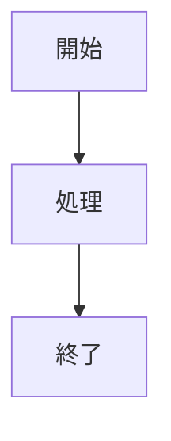
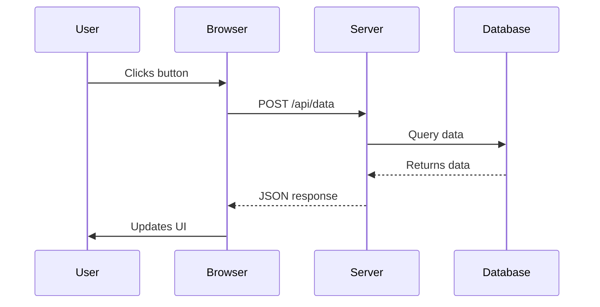

# コードブロック拡張実装ガイド

## 概要

このドキュメントは、UMDパーサーのコードブロック拡張機能（シンタックスハイライトとMermaid図対応）の実装と使用方法について説明します。

## 実装した機能

### 1. シンタックスハイライト対応

コードブロック（` ``` `）に言語指定があると、自動的に言語情報が`class`属性に追加されます。

#### サポート言語

```
rust, python, javascript, typescript, jsx, tsx,
html, css, scss, less,
java, kotlin, go, c, cpp, csharp, swift, objc,
php, ruby, perl, bash, shell, zsh, fish,
sql, mysql, postgresql, mongodb,
json, yaml, toml, xml, markdown, latex,
dockerfile, nginx, apache, lua, vim, elisp,
mermaid
```

#### 基本的な使用例

````markdown
```rust
fn main() {
    println!("Hello, World!");
}
```
````

````

**出力HTML:**
```html
<pre><code class="language-rust">fn main() {
    println!("Hello, World!");
}</code></pre>
````

### 2. ファイル名付きコードブロック

コード内に`@filename: filename.ext`という記法を含めると、自動的に`<figure>`でラップされ、`<figcaption>`がファイル名として表示されます。

#### 使用例

````markdown
```rust
// @filename: main.rs
fn main() {
    println!("Hello, World!");
}
```
````

````

**出力HTML:**
```html
<figure class="code-block code-block-rust">
  <figcaption class="code-filename">main.rs</figcaption>
  <pre><code class="language-rust">// @filename: main.rs
fn main() {
    println!("Hello, World!");
}</code></pre>
</figure>
````

**利点:**

- `<figure>`要素で意味的なラッピング
- `<figcaption>`でファイル名を表示
- CSSで`code-block-{language}`クラスを使用して言語別スタイリング可能

### 3. Mermaid図のレンダリング対応

`language-mermaid`クラスを持つコードブロックは、自動的に`<div class="mermaid-diagram">`でラップされます。

#### 基本的な使用例

````markdown

````

````

**出力HTML:**
```html
<div class="mermaid-diagram" id="mermaid-{hash}">
  <pre><code class="language-mermaid" data-mermaid-source="...">
    graph TD
        A[開始] --> B[処理]
        B --> C[終了]
  </code></pre>
</div>
````

## フロントエンド対応

### Mermaid図のレンダリング

Mermaid図は、フロントエンド（JavaScript）でレンダリングする必要があります。以下の方法をサポートしています。

#### 1. Mermaid.js CDN (推奨)

```html
<script
  async
  src="https://cdn.jsdelivr.net/npm/mermaid/dist/mermaid.min.js"
></script>

<script>
  // Mermaid初期化（読み込み後）
  document.addEventListener("DOMContentLoaded", function () {
    mermaid.initialize({
      startOnLoad: true,
      theme: "default", // 'dark' for dark mode
    });
    mermaid.contentLoaded();
  });
</script>
```

#### 2. Bootstrap統合版（推奨）

```html
<script
  async
  src="https://cdn.jsdelivr.net/npm/mermaid/dist/mermaid.min.js"
></script>

<script>
  document.addEventListener("DOMContentLoaded", function () {
    const isDarkMode =
      document.documentElement.getAttribute("data-bs-theme") === "dark";

    mermaid.initialize({
      startOnLoad: true,
      theme: isDarkMode ? "dark" : "light",
      primaryColor: isDarkMode ? "#6c757d" : "#0d6efd",
      primaryBorderColor: isDarkMode ? "#495057" : "#0d6efd",
      primaryTextColor: isDarkMode ? "#fff" : "#000",
      background: isDarkMode ? "#212529" : "#fff",
    });

    // ダークモード切り替え時の対応
    const observer = new MutationObserver(() => {
      mermaid.contentLoaded();
    });

    observer.observe(document.documentElement, {
      attributes: true,
      attributeFilter: ["data-bs-theme"],
    });

    mermaid.contentLoaded();
  });
</script>
```

#### 3. モダンブラウザ向け（ES6モジュール）

```html
<script type="module">
  import mermaid from "https://cdn.jsdelivr.net/npm/mermaid@10/dist/mermaid.esm.min.mjs";

  mermaid.initialize({
    startOnLoad: true,
    theme: "default",
  });
  mermaid.contentLoaded();
</script>
```

### シンタックスハイライト

複数のシンタックスハイライトライブラリに対応しています。

#### 1. Highlight.js (推奨・最も汎用的)

```html
<link
  rel="stylesheet"
  href="https://cdnjs.cloudflare.com/ajax/libs/highlight.js/11.9.0/styles/atom-one-dark.min.css"
/>
<script src="https://cdnjs.cloudflare.com/ajax/libs/highlight.js/11.9.0/highlight.min.js"></script>

<script>
  document.addEventListener("DOMContentLoaded", function () {
    document.querySelectorAll("pre code").forEach((el) => {
      hljs.highlightElement(el);
    });
  });
</script>
```

#### 2. Prism.js

```html
<link
  rel="stylesheet"
  href="https://cdnjs.cloudflare.com/ajax/libs/prism/1.29.0/themes/prism-tomorrow.min.css"
/>
<script src="https://cdnjs.cloudflare.com/ajax/libs/prism/1.29.0/prism.min.js"></script>
<script src="https://cdnjs.cloudflare.com/ajax/libs/prism/1.29.0/components/prism-rust.min.js"></script>
<script src="https://cdnjs.cloudflare.com/ajax/libs/prism/1.29.0/components/prism-python.min.js"></script>
<!-- 必要な言語プラグインを追加 -->

<script>
  document.addEventListener("DOMContentLoaded", function () {
    Prism.highlightAll();
  });
</script>
```

#### 3. Bootstrap統合版カスタムテーマ

```css
/* ライトモード */
:root {
  --code-bg: #f8f9fa;
  --code-text: #212529;
  --code-keyword: #0d6efd;
  --code-string: #198754;
  --code-comment: #6c757d;
  --code-number: #fd7e14;
}

/* ダークモード */
[data-bs-theme="dark"] {
  --code-bg: #212529;
  --code-text: #f8f9fa;
  --code-keyword: #0dcaf0;
  --code-string: #13c798;
  --code-comment: #adb5bd;
  --code-number: #ffc107;
}

code {
  background-color: var(--code-bg);
  color: var(--code-text);
}

pre code {
  display: block;
  padding: 1rem;
  border-radius: 0.25rem;
  overflow-x: auto;
}

/* figcaption スタイル */
.code-block figcaption {
  background-color: var(--bs-secondary);
  color: var(--bs-secondary-text);
  padding: 0.5rem 1rem;
  border-radius: 0.25rem 0.25rem 0 0;
  font-size: 0.875rem;
  font-weight: 500;
}

.code-block {
  margin: 1rem 0;
  border-radius: 0.25rem;
  overflow: hidden;
  border: 1px solid var(--bs-border-color);
}
```

## 技術実装の詳細

### Rustコード構成

実装は`src/extensions/code_block.rs`に実装されています。

#### 主要関数

- `process_code_blocks(html: &str) -> String` - メイン処理関数
- `process_mermaid_blocks(html: &str) -> String` - Mermaid検出と変換
- `process_syntax_highlighted_blocks(html: &str) -> String` - 言語クラス追加
- `extract_filename_from_data(code: &str) -> Option<String>` - ファイル名抽出
- `simple_hash(data: &str) -> u64` - 図のID生成用ハッシュ

#### 処理パイプライン

1. **Mermaid検出**: `language-mermaid`クラスを検索
2. **言語別処理**: `language-{lang}`クラスを検索
3. **ファイル名抽出**: コード先頭行の`@filename:` をパース
4. **HTML変換**: 検出結果に応じて適切なHTMLを生成

### パフォーマンス考慮

- 正規表現はシンプルに保つ（性能優先）
- HTML生成は文字列連結（アロケーション最小化）
- キャッシュ不要（毎回処理だが、高速）

## 使用例

### 複雑なMermaid図

````markdown

````

````

### 複数言語のコードブロック

```markdown
```javascript
// @filename: app.js
function hello() {
  console.log("Hello, World!");
}
````

```python
# @filename: script.py
def hello():
    print("Hello, World!")
```

```rust
// @filename: main.rs
fn main() {
    println!("Hello, World!");
}
```

```

## 制限事項と今後の拡張

### 現在の制限

- Mermaidのレンダリングはフロントエンド依存
- シンタックスハイライトもフロントエンド側で実装
- ファイル名はメタデータコメントで指定（将来的には言語別対応予定）

### 今後の拡張計画

1. **複数行ファイル名指定**: YAML形式のメタデータをサポート
2. **コピーボタン**: 自動生成（JavaScript側）
3. **行番号表示**: 言語別対応（JavaScript側）
4. **行選択ハイライト**: シンタックスハイライトライブラリと統合
5. **キャッシング**: SVG出力のキャッシュ（Mermaid高速化）

## トラブルシューティング

### Mermaid図が表示されない

1. `<script>`タグが読み込まれているか確認
2. ブラウザコンソールでエラーを確認
3. `mermaid.contentLoaded()`が呼び出されているか確認
4. `data-mermaid-source`属性にコードがあるか確認

### シンタックスハイライトが効かない

1. ハイライトライブラリのCSS/JSが読み込まれているか確認
2. `<code>`要素に`language-{lang}`クラスがあるか確認
3. ブラウザのデベロッパーツールで適用されているクラスを確認

### ファイル名が表示されない

1. `// @filename:` の後に空白があるか確認
2. ファイル名に特殊文字が含まれていないか確認
3. 最初の行にコメントがあるか確認
```
