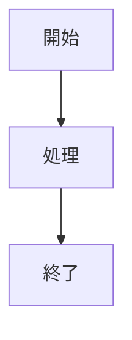
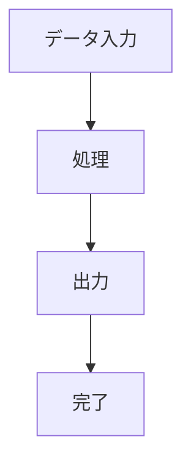
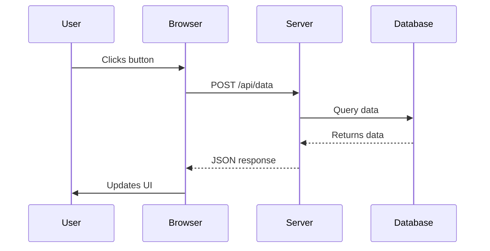

# コードブロック拡張実装ガイド

## 概要

このドキュメントは、UMDパーサーのコードブロック拡張機能（シンタックスハイライトとMermaid図対応）の実装と使用方法について説明します。

## 実装した機能

### 1. シンタックスハイライト対応

コードブロック（` ``` `）に言語指定があると、自動的に言語情報が`class`属性に追加されます。

#### サポート言語

```
rust, python, javascript, typescript, jsx, tsx,
html, css, scss, less,
java, kotlin, go, c, cpp, csharp, swift, objc,
php, ruby, perl, bash, shell, zsh, fish,
sql, mysql, postgresql, mongodb,
json, yaml, toml, xml, markdown, latex,
dockerfile, nginx, apache, lua, vim, elisp,
mermaid
```

#### 基本的な使用例

````markdown
```rust
fn main() {
    println!("Hello, World!");
}
```
````

**出力HTML:**

```html
<pre><code class="language-rust syntect-highlight" data-highlighted="true">fn main() {
    println!("Hello, World!");
}</code></pre>
```

#### ハイブリッド方式（処理フロー）

シンタックスハイライトは **Rust優先 + フロントフォールバック** で動作します。

- Syntectで処理できる言語は、Rust側でハイライト済みHTMLを生成
- ハイライト済み要素には `data-highlighted="true"` を付与
- Syntect未対応言語は `language-xxx` のまま出力し、フロント側で処理可能
- Mermaidは別経路でSVGに変換され、通常のコードハイライト対象から外れる

```mermaid
flowchart TD
  A[Markdown fenced code] --> B[comrak: code class=language-xxx]
  B --> C{言語は mermaid?}
  C -->|Yes| D[Rust: MermaidをSVG化]
  D --> E[figure.mermaid-diagram を出力]
  C -->|No| F{Syntectでハイライト可能?}
  F -->|Yes| G[Rust: ハイライトHTML生成]
  G --> H[code class="language-xxx syntect-highlight"\ndata-highlighted="true"]
  F -->|No| I[code class="language-xxx" のまま出力]
  H --> J[フロント側ハイライト対象から除外]
  I --> K[フロント側で Prism/HLJS/Shiki が処理]
```

### 2. ファイル名付きコードブロック

Markdown標準の記法（` ```lang: filename `）を使用すると、自動的に`<figure>`でラップされ、`<figcaption>`がファイル名として表示されます。

#### 使用例

````markdown
```rust: main.rs
fn main() {
    println!("Hello, World!");
}
```
````

**出力HTML:**

```html
<figure class="code-block code-block-rust">
  <figcaption class="code-filename">main.rs</figcaption>
  <pre><code class="language-rust syntect-highlight" data-highlighted="true">fn main() {
    println!("Hello, World!");
}</code></pre>
</figure>
```

**利点:**

- `<figure>`要素で意味的なラッピング
- `<figcaption>`でファイル名を表示
- CSSで`code-block-{language}`クラスを使用して言語別スタイリング可能

### 3. Mermaid図のレンダリング対応

`language-mermaid`クラスを持つコードブロックは、**Rust側で自動的にSVGに変換され**、セマンティックな`<figure>`タグでラップされます。タイトル指定も可能です（` ```mermaid: タイトル `）。

#### 基本的な使用例（タイトルなし）

````markdown

````

**出力HTML（Rust側で生成）:**

```html
<figure
  class="code-block code-block-mermaid mermaid-diagram"
  id="mermaid-{uuid}"
  data-mermaid-source="graph TD..."
>
  <svg xmlns="http://www.w3.org/2000/svg" viewBox="0 0 800 400">
    <!-- Bootstrap CSS変数でスタイル付けされたSVG要素 -->
    <rect fill="var(--bs-blue, #0d6efd)" />
    <text fill="var(--bs-body-color)" />
  </svg>
</figure>
```

#### タイトル付きの例

````markdown

````

**出力HTML（タイトル付き）:**

```html
<figure
  class="code-block code-block-mermaid mermaid-diagram"
  id="mermaid-{uuid}"
  data-mermaid-source="graph TD..."
>
  <figcaption class="code-title">システムフロー</figcaption>
  <svg xmlns="http://www.w3.org/2000/svg" viewBox="0 0 800 400">
    <!-- Bootstrap CSS変数でスタイル付けされたSVG要素 -->
  </svg>
</figure>
```

**特徴:**

- ✅ サーバー側（Rust）で完全に処理
- ✅ Bootstrap CSS 変数でダークモード自動対応
- ✅ SEO対応（HTMLに含まれた状態で配信）
- ✅ JavaScript不要
- ✅ セマンティックな`<figure>`でラップ
- ✅ タイトルは省略可能（` ```mermaid: タイトル ` で指定）
- ✅ ブロック型プラグイン（CENTER: など）との連携可能

## フロントエンド対応

### Mermaid図

**Mermaid図は Rust側で完全にSVGに変換されるため、フロントエンドJavaScriptの処理は不要です。**

ただし、`data-mermaid-source`属性にMermaidコードが保存されているため、デバッグや再レンダリングが必要な場合は以下の方法で処理できます：

#### デバッグ用：Mermaidコードの表示

```javascript
// Mermaidコードをデバッグ表示
document.querySelectorAll("figure.mermaid-diagram").forEach((figure) => {
  const source = figure.getAttribute("data-mermaid-source");
  console.log("Mermaid source:", source);
});
```

### シンタックスハイライト

複数のシンタックスハイライトライブラリに対応しています。

#### 1. Highlight.js (推奨・最も汎用的)

```html
<link
  rel="stylesheet"
  href="https://cdnjs.cloudflare.com/ajax/libs/highlight.js/11.9.0/styles/atom-one-dark.min.css"
/>
<script src="https://cdnjs.cloudflare.com/ajax/libs/highlight.js/11.9.0/highlight.min.js"></script>

<script>
  document.addEventListener("DOMContentLoaded", function () {
    document
      .querySelectorAll(
        'pre code[class*="language-"]:not([data-highlighted="true"])',
      )
      .forEach((el) => {
        hljs.highlightElement(el);
      });
  });
</script>
```

#### 2. Prism.js

```html
<link
  rel="stylesheet"
  href="https://cdnjs.cloudflare.com/ajax/libs/prism/1.29.0/themes/prism-tomorrow.min.css"
/>
<script src="https://cdnjs.cloudflare.com/ajax/libs/prism/1.29.0/prism.min.js"></script>
<script src="https://cdnjs.cloudflare.com/ajax/libs/prism/1.29.0/components/prism-rust.min.js"></script>
<script src="https://cdnjs.cloudflare.com/ajax/libs/prism/1.29.0/components/prism-python.min.js"></script>
<!-- 必要な言語プラグインを追加 -->

<script>
  document.addEventListener("DOMContentLoaded", function () {
    document
      .querySelectorAll(
        'pre code[class*="language-"]:not([data-highlighted="true"])',
      )
      .forEach((el) => Prism.highlightElement(el));
  });
</script>
```

#### 3. Bootstrap統合版カスタムテーマ

```css
/* ライトモード */
:root {
  --code-bg: #f8f9fa;
  --code-text: #212529;
  --code-keyword: #0d6efd;
  --code-string: #198754;
  --code-comment: #6c757d;
  --code-number: #fd7e14;
}

/* ダークモード */
[data-bs-theme="dark"] {
  --code-bg: #212529;
  --code-text: #f8f9fa;
  --code-keyword: #0dcaf0;
  --code-string: #13c798;
  --code-comment: #adb5bd;
  --code-number: #ffc107;
}

code {
  background-color: var(--code-bg);
  color: var(--code-text);
}

pre code {
  display: block;
  padding: 1rem;
  border-radius: 0.25rem;
  overflow-x: auto;
}

/* figcaption スタイル */
.code-block figcaption {
  background-color: var(--bs-secondary);
  color: var(--bs-secondary-color);
  padding: 0.5rem 1rem;
  border-radius: 0.25rem 0.25rem 0 0;
  font-size: 0.875rem;
  font-weight: 500;
}

.code-block {
  margin: 1rem 0;
  border-radius: 0.25rem;
  overflow: hidden;
  border: 1px solid var(--bs-border-color);
}
```

## 技術実装の詳細

### Rustコード構成

実装は`src/extensions/code_block.rs`に実装されています。

#### 主要関数

- `process_code_blocks(html: &str) -> String` - メイン処理関数
- `process_mermaid_blocks(html: &str) -> String` - Mermaid検出と変換
- `render_mermaid_as_svg(mermaid_code: &str) -> String` - Mermaid → SVG変換
- `process_syntax_highlighted_blocks(html: &str) -> String` - Syntectハイライト + フォールバック出力
- `extract_filename_from_meta(meta: &str) -> Option<String>` - `data-meta`からファイル名抽出
- `inject_bootstrap_colors(svg: &str) -> String` - Bootstrap CSS変数の注入

#### 処理パイプライン

1. **Mermaid処理**: `language-mermaid`クラスを検索し、Rust側でSVGに変換
2. **言語別処理**: `language-{lang}`を判定し、Syntectで処理可能ならハイライトHTMLを生成
3. **状態付与**: Rust側で処理した`<code>`に`data-highlighted="true"`を付与
4. **フォールバック**: 未対応言語は`language-{lang}`を保持してそのまま出力
5. **メタ処理**: `data-meta`からファイル名を抽出し、必要に応じて`<figure>/<figcaption>`を生成

### パフォーマンス考慮

- 正規表現はシンプルに保つ（性能優先）
- HTML生成は文字列連結（アロケーション最小化）
- キャッシュ不要（毎回処理だが、高速）

## 使用例

### 複雑なMermaid図

````markdown

````

### 複数言語のコードブロック

````markdown
```javascript: app.js
function hello() {
  console.log("Hello, World!");
}
```

```python: script.py
def hello():
    print("Hello, World!")
```

```rust: main.rs
fn main() {
    println!("Hello, World!");
}
```
````

## 制限事項と今後の拡張

### 現在の制限

- Mermaidのレンダリングはサーバー（Rust）完結
- Syntect未対応言語はフロントエンド側ハイライトの導入が必要
- **コードブロックタイトルは標準 Markdown 形式で指定**（任意のテキストを使用可能、省略できます）

### 今後の拡張計画

1. **複数行タイトル指定**: YAML形式のメタデータをサポート
2. **コピーボタン**: 自動生成（JavaScript側）
3. **行番号表示**: 言語別対応（JavaScript側）
4. **行選択ハイライト**: シンタックスハイライトライブラリと統合
5. **キャッシング**: SVG出力のキャッシュ（Mermaid高速化）

## トラブルシューティング

### Mermaid図が表示されない

1. ブラウザコンソールでエラーがないか確認
2. `data-mermaid-source`属性にコードがあるか確認
3. SVG要素が正しく埋め込まれているか確認

### シンタックスハイライトが効かない

1. ハイライトライブラリのCSS/JSが読み込まれているか確認
2. `<code>`要素に`language-{lang}`クラスがあるか確認
3. `data-highlighted="true"` が付いている場合は、Rust側で処理済みのためフロント側で再処理しない
4. ブラウザのデベロッパーツールで適用されているクラスを確認

### コードブロックタイトルが表示されない

1. フェンス情報文字列に `:` 区切り文字が含まれているか確認
2. コードブロックタイトルに特殊文字が含まれていないか確認
3. 言語指定と `:` の間に空白がないか確認（例：` ```rust: ` ではなく ` ```rust:filename.rs `）
