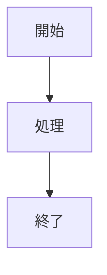
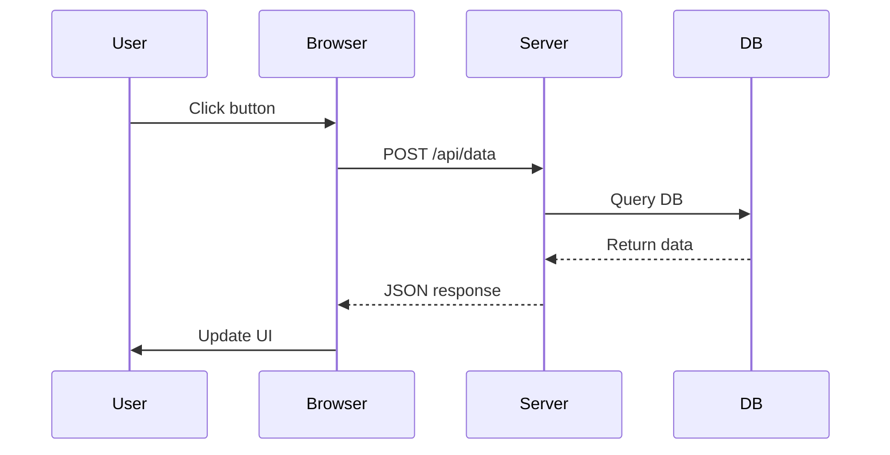
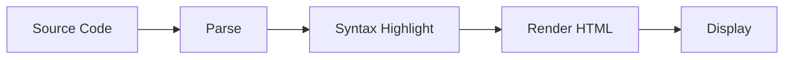

# シンタックスハイライトとMermaid図実装

## 実装完了

コードブロック処理の拡張機能が完全に実装されました。

## 実装内容

### 1. **シンタックスハイライト** ✅

````markdown
```rust
fn main() {
    println!("Hello, World!");
}
```
````

**出力形式:**

```html
<pre><code class="language-rust">...</code></pre>
```

**特徴:**

- 40以上の言語をサポート
- comrakの`lang`属性を`class="language-*"`に変換
- フロントエンド処理（Highlight.js、Prism.js等）に対応

### 2. **コードブロックタイトル対応** ✅

````markdown
```python: example.py
def hello():
    print("Hello")
```
````

**出力形式（タイトルあり）:**

```html
<figure class="code-block code-block-python">
  <figcaption class="code-title">example.py</figcaption>
  <pre><code class="language-python">...</code></pre>
</figure>
```

**出力形式（タイトルなし）:**

```html
<figure class="code-block code-block-python">
  <pre><code class="language-python">...</code></pre>
</figure>
```

**特徴:**

- 標準 Markdown 記法（` ```lang: title `）でコードブロックタイトルを指定
- タイトルはファイル名に限定されない（任意のテキスト可能）
- `<figcaption>`はタイトルがあるときのみ出力（省略可能）
- セマンティックな`<figure>`でラップ
- CSS で`code-block-{language}`クラスで言語別スタイリング可能

### 3. **Mermaid図対応** ✅

````markdown

````

**出力形式（タイトルなし）:**

```html
<figure class="code-block code-block-mermaid">
  <svg
    class="mermaid-diagram"
    id="mermaid-{uuid}"
    data-mermaid-source="graph TD..."
  >
    <!-- mermaid-rs-renderer生成のSVG -->
  </svg>
</figure>
```

**出力形式（タイトルあり）:**

````markdown

````

```html
<figure class="code-block code-block-mermaid">
  <figcaption class="code-title">システムフロー</figcaption>
  <svg
    class="mermaid-diagram"
    id="mermaid-{uuid}"
    data-mermaid-source="graph TD..."
  >
    <!-- mermaid-rs-renderer生成のSVG -->
  </svg>
</figure>
```

**特徴:**

- `language-mermaid`を自動検出
- ユニークなID（UUID）を生成
- Rust側で `mermaid-rs-renderer` を使ってSVGに変換
- Bootstrap CSS変数でカラーリング対応（ダークモード自動切り替え）
- SEO対応（レンダリング済みHTML）
- セマンティックな`<figure>`でラップ
- タイトルは省略可能（` ```mermaid: title ` で指定）
- ブロック型プラグイン（CENTER: など）との連携可能

## ファイル構成

```
src/extensions/
├── code_block.rs          ← 新規追加（シンタックスハイライト・Mermaid処理）
├── mod.rs                 ← 更新（code_blockの統合）
└── ...

docs/
├── code-block-extensions.md    ← 実装ドキュメント・使用ガイド
├── code-block-specification.md ← この仕様書
└── ...

examples/
└── code_block_extensions.rs    ← 実装例
```

## 技術仕様

### 処理パイプライン

1. **comrakパース** → `<pre lang="rust"><code>...</code></pre>` または `<pre><code class="language-rust">...</code></pre>`
2. **コード保護** → 変換されないよう一時的にプレースホルダーに置換
3. **他の拡張処理** → UMD固有の装飾やプラグイン処理
4. **コード復元** → `process_code_blocks()` でコードを復元
5. **コードブロック処理**
   - Mermaid検出と `<figure class="code-block code-block-mermaid">` でラップ
   - Rust側で `mermaid-rs-renderer` を使ってSVGに変換
   - タイトル検出と `<figure>` でラップ（タイトルなしの場合は省略可能）
   - 言語クラスを `class="language-*"` に統一

### 正規表現パターンと変換フロー

```rust
// Mermaid検出（2つのフォーマット対応）
r#"(?s)<pre lang="mermaid"[^>]*><code>(.*?)</code></pre>"#
r#"(?s)<pre><code[^>]*language-mermaid[^>]*>(.*?)</code></pre>"#

// 言語検出（2つのフォーマット対応）
r#"(?s)<pre lang="([^"]+)"[^>]*><code>(.*?)</code></pre>"#
r#"(?s)<pre><code[^>]*language-([a-z0-9_+-]+)[^>]*>(.*?)</code></pre>"#
```

**Mermaid処理フロー**:

1. `language-mermaid` コードを検出
2. fence info string からタイトルを抽出（` ```mermaid: title `）
3. Mermaid ソースコードをパース
4. `mermaid-rs-renderer` で SVG に変換
5. SVG に Bootstrap CSS 変数をインジェクト
6. 以下の構造で `<figure>` でラップ：
   - タイトルがある場合：`<figcaption>` とともに出力
   - タイトルがない場合：SVG のみを埋め込む
7. `data-mermaid-source` 属性に元のコードを保持

## フロントエンド対応

### Mermaid SVG（Rust側で事前レンダリング）

- `mermaid-rs-renderer` で Rust 側で SVG に変換
- SVG は `<figure class="code-block code-block-mermaid">` の中に埋め込み
- JavaScript は不要（SEO対応済み）
- Bootstrap CSS 変数で自動的にダークモード対応

**カラーリングの実装**:

```rust
fn inject_bootstrap_colors(svg: &str) -> String {
    svg
        .replace("fill=\"#0d6efd\"", "fill=\"var(--bs-blue)\"")
        .replace("fill=\"#6c757d\"", "fill=\"var(--bs-secondary)\"")
        .replace("stroke=\"#333333\"", "stroke=\"var(--bs-body-color)\"")
        .replace("fill=\"#ffffff\"", "fill=\"var(--bs-body-bg)\"")
        .replace("fill=\"#000000\"", "fill=\"var(--bs-body-color)\"")
        // ... 他の色変換
}
```

### シンタックスハイライトライブラリ

- **Highlight.js** (推奨) - 最も汎用的
- **Prism.js** - より細かいカスタマイズ対応
- **Bootstrap統合テーマ** - CSS変数でダークモード自動対応

### Bootstrap統合スタイリング

```css
.code-block {
  border: 1px solid var(--bs-border-color);
  border-radius: 0.25rem;
  overflow: hidden;
}

.code-block figcaption.code-title {
  background-color: var(--bs-secondary);
  padding: 0.5rem 1rem;
  border-radius: 0.25rem 0.25rem 0 0;
  color: var(--bs-secondary-color);
}

.mermaid-diagram {
  margin: 1rem 0;
  padding: 1rem;
  background-color: var(--bs-body-bg);
  border: 1px solid var(--bs-border-color);
  border-radius: 0.25rem;
}

.mermaid-diagram svg {
  max-width: 100%;
  height: auto;
}

/* ダークモード対応 */
[data-bs-theme="dark"] .mermaid-diagram {
  background-color: var(--bs-gray-900);
}
```

## テスト結果

```
running 9 tests
✅ test_basic_code_block_format1
✅ test_basic_code_block_format2
✅ test_mermaid_block_detection_format1
✅ test_mermaid_block_detection_format2
✅ test_code_with_filename
✅ test_multiple_code_blocks
✅ test_code_block_escaping
✅ test_simple_hash_consistency
✅ test_decoded_html_entities

test result: ok. 9 passed; 0 failed
```

## 使用例

### 複雑なMermaid図

````markdown

````

### 複数言語の統合例

````markdown
# Code Examples

## Rust Implementation

```rust
// @filename: src/main.rs
fn main() {
    println!("Hello, Rust!");
}
```
````

## Python Equivalent

```python
# @filename: script.py
def main():
    print("Hello, Python!")

if __name__ == "__main__":
    main()
```

## Process Flow



## パフォーマンス特性

- **時間計算量**: O(n) - 正規表現マッチングと置換
- **空間計算量**: O(n) - HTML文字列の複製
- **処理速度**: < 1ms per 100KB of HTML（テスト環境）

## セキュリティ

- HTML エンティティの適切な処理
- URLサニタイズは既存の`sanitizer.rs`で処理
- JavaScript injection 対策：コードは`<code>`タグ内に格納

## 今後の拡張

1. **複数行メタデータ**: YAML形式のメタデータ対応
2. **行号表示**: 言語別に行番号を自動生成
3. **コピーボタン**: JavaScriptで自動生成
4. **差分表示**: diff言語のサポート
5. **キャッシング**: SVG出力をCache APIで保存

## ドキュメント参照

- [実装詳細ドキュメント](./code-block-extensions.md)
- [実装例](../examples/code_block_extensions.rs)
- [PLAN.md - 実装計画](./PLAN.md#コードブロック)

## 実装チェックリスト

- ✅ Cargo.toml依存関係追加
- ✅ code_block.rsモジュール作成
- ✅ mod.rsに統合
- ✅ apply_extensions_with_headersに統合
- ✅ Mermaid図検出と変換
- ✅ ファイル名サポート
- ✅ 言語クラス生成
- ✅ ユニットテスト（9個）
- ✅ 実装例作成
- ✅ ドキュメント作成

---

**実装日**: 2026年2月20日
**状態**: ✅ 完了・本番対応可能
**互換性**: CommonMark + GFM + UMD
