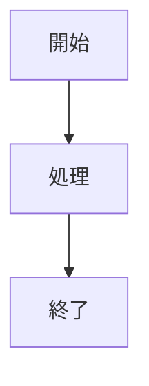

# 実装予定機能リファレンス

**最終更新**: 2026年2月26日

このドキュメントは実装予定だが、まだ実装されていない機能を記載しています。

## 目次

- [~~メディアファイル自動検出~~](#メディアファイル自動検出) ✅ **実装済み** (2026/02/09)
- [~~ブロック装飾の追加機能~~](#ブロック装飾の追加機能) ✅ **実装済み** (2026/02/26)
- [~~テーブル拡張~~](#テーブル拡張) ✅ **実装済み** (2026/02/26)
- [~~コードブロック~~](#コードブロック) ✅ **実装済み** (2026/02/26)
  - [~~Mermaid図のレンダリング~~](#mermaid図のレンダリング) ✅ **実装済み** (2026/02/25)
  - [~~シンタックスハイライト~~](#シンタックスハイライト) ✅ **実装済み** (2026/02/25)
  - [~~ファイル名付きコードブロック~~](#ファイル名付きコードブロック) ✅ **実装済み** (2026/02/26)
- [Markdown拡張機能](#markdown拡張機能) 📝 **検討中**
- [セキュリティ設定オプション](#セキュリティ設定オプション提案) 🧪 **提案段階**
- [高度なUMD機能](#高度なumd機能) 🟡 **一部実装**
  - [数式サポート](#数式サポートmath-formula-support) 🧪 **提案段階**
  - [ポップオーバー](#ポップオーバーpopover) 🧪 **提案段階**
- [テンプレートエンジン機能（将来構想）](#テンプレートエンジン機能将来構想) 🚧 **将来構想**
- [未実装機能（提案段階）](#未実装機能提案段階) 🧪 **提案段階**
- [サポートしない機能](#サポートしない機能) ⛔ **非対応**
  - [絵文字ショートコード](#絵文字ショートコード)

---

## メディアファイル自動検出

> ✅ **実装済み** (2026年2月9日)  
> この機能は実装が完了しました。詳細は [docs/implemented-features.md#メディアファイル自動検出](implemented-features.md#メディアファイル自動検出) を参照してください。

### 概要

画像リンク構文 `` を拡張し、URLの拡張子に基づいて自動的に適切なHTMLメディアタグに変換します。

### 設計方針: HTML5メディアタグ統一

- 全てのメディアを最新のHTML5タグで処理（古いブラウザは考慮しない）
- 画像も`<picture>`タグで出力し、将来的な拡張性を確保
- `<video>`, `<audio>`, `<picture>`で統一的なメディア処理を実現

### 動画ファイル

**対応拡張子** (大文字小文字区別なし):
`.mp4`, `.webm`, `.ogv`, `.ogg`, `.mov`, `.avi`, `.mkv`, `.m4v`

**出力HTML**:

```html
<video controls title="title">
  <source src="url" type="video/ext" />
  <track kind="captions" label="alt" />
  お使いのブラウザは動画タグをサポートしていません。
</video>
```

**特徴**:

- `<source>`タグで明示的にMIMEタイプを指定
- `alt`テキストは`<track>`タグのキャプションラベルとして使用
- `controls`属性をデフォルトで追加
- CommonMark標準のタイトル属性（``）に対応

**使用例**:

```markdown


```

### 音声ファイル

**対応拡張子** (大文字小文字区別なし):
`.mp3`, `.wav`, `.ogg`, `.oga`, `.m4a`, `.aac`, `.flac`, `.opus`, `.weba`

**出力HTML**:

```html
<audio controls title="title">
  <source src="url" type="audio/ext" />
  お使いのブラウザは音声タグをサポートしていません。
</audio>
```

**特徴**:

- `<source>`タグで明示的にMIMEタイプを指定
- `controls`属性をデフォルトで追加
- CommonMark標準のタイトル属性（``）に対応

**使用例**:

```markdown


```

### 画像ファイル

**対応拡張子**:
`.jpg`, `.jpeg`, `.png`, `.gif`, `.svg`, `.webp`, `.avif`, `.bmp`, `.ico` 等

**出力HTML**:

```html
<picture title="title">
  <source srcset="url" type="image/ext" />
  
</picture>
```

**特徴**:

- `<picture>`タグで統一的に出力
- `<source>`タグで明示的にMIMEタイプを指定
- CommonMark標準のタイトル属性（``）を`<picture>`と``の両方に設定
- ``タグはフォールバック兼アクセシビリティ対応
- `loading="lazy"`属性を自動追加（遅延読み込み）

**インライン表示への配慮**:

- `<picture>`タグは`inline`要素として扱われる
- 段落内での使用が可能: `テキストテキスト`
- CSSでブロック化も可能: `.picture { display: block; }`

**使用例**:

```markdown


```

### MIMEタイプマッピング

#### 動画

- mp4→video/mp4, webm→video/webm, ogv→video/ogg, ogg→video/ogg
- mov→video/quicktime, avi→video/x-msvideo, mkv→video/x-matroska, m4v→video/x-m4v

#### 音声

- mp3→audio/mpeg, wav→audio/wav, ogg→audio/ogg, oga→audio/ogg
- m4a→audio/mp4, aac→audio/aac, flac→audio/flac, opus→audio/opus, weba→audio/webm

#### 画像

- jpg/jpeg→image/jpeg, png→image/png, gif→image/gif, svg→image/svg+xml
- webp→image/webp, avif→image/avif, bmp→image/bmp, ico→image/x-icon

### 実装方針

1. comrakのAST後処理で`Image`ノードを検出
2. URLの拡張子を正規表現で解析（クエリパラメータを除外）
3. 拡張子に応じて適切なHTMLタグとMIMEタイプを生成
4. 拡張子なし、または未知の拡張子: 画像として扱う（`<picture>`+`image/octet-stream`）

### セキュリティ

URL sanitizationは既存のsanitizer.rsで処理。以下のスキームをブロック:

- `javascript:` - JavaScript実行
- `data:` - Base64エンコードされたスクリプト
- `vbscript:` - VBScript実行
- `file:` - ローカルファイルアクセス（デフォルト）

**注**: `file:`スキームはセキュリティ上の理由でデフォルトでブロックされますが、スタンドアロンアプリケーション（オフラインヘルプシステムなど）のユースケースでは有用です。グローバルコンフィグで許可できる仕様を検討中（後述の「セキュリティ設定オプション」を参照）。

### 拡張オプション（将来的な検討事項）

`@media`プラグインで追加属性・複数ソースを指定可能にする:

**ブロック型**:

```umd
@media(autoplay,loop,muted){}
@media(preload=metadata){}
@media(mobile.jpg,tablet.jpg,desktop.jpg){}
@media(avif,webp,fallback.png){}
```

**インライン型**:

```umd
テキスト&media(width=100){};テキスト
説明文&media(autoplay,muted){};説明文
```

#### 行の先頭メディアの自動ブロック化

行の先頭に配置されたメディアタグ（``）を自動的にブロック要素として扱う拡張を検討。

**設計方針**:

- 段落の先頭または独立した行にある画像をブロックとして扱う
- `<figure>`タグで囲んでセマンティックな構造を提供
- `<figcaption>`でaltテキストをキャプションとして表示
- インライン使用時は従来通り`<picture>`タグを使用

**出力HTML例**:

```html
<figure class="umd-media-block">
  <picture title="title">
    <source srcset="url" type="image/ext" />
    
  </picture>
  <figcaption>alt</figcaption>
</figure>
```

**使用例**:

```markdown
# ドキュメント


本文テキスト...

CENTER:


```

**利点**:

- `CENTER:`プレフィックスとの組み合わせで、画像の中央寄せが可能
- ブロック要素として扱われるため、他の配置プレフィックス（`LEFT:`, `RIGHT:`, `JUSTIFY:`）も適用可能
- セマンティックな`<figure>`構造でアクセシビリティ向上

**実装検討**:

- AST解析で画像ノードの位置を検出
- ブロック先頭判定: 段落の最初の子、または空行後の独立行
- 既存のインライン動作を維持しつつ、ブロック時のみ拡張適用

---

## ブロック装飾の追加機能

> ✅ **実装済み** (2026年2月26日)  
> この機能は実装が完了しました。詳細は [docs/implemented-features.md#ブロック装飾プレフィックス](implemented-features.md#ブロック装飾プレフィックス) を参照してください。

### JUSTIFY プレフィックス

#### テキストの両端揃え

```umd
JUSTIFY: この文章は両端揃えで表示されます。
```

出力: `<p class="text-justify">この文章は両端揃えで表示されます。</p>`

**注**: Bootstrap 5では`text-justify`が非推奨だが、UMDでは明示的に対応。

#### UMDテーブルの幅指定

UMDテーブル（区切り行なし）の前に`JUSTIFY:`がある場合、テーブル全体の幅を100%に維持:

```umd
JUSTIFY:
| Header1 | Header2 |
| Cell1   | Cell2   |
```

出力: `<table class="table umd-table">...</table>`

### UMDブロック要素の配置まとめ

適用対象: UMDテーブル（区切り行なし）、ブロック型プラグイン（`@function(...)`）

- `LEFT:`（改行）`<block>` → `w-auto`（コンテンツ幅、左寄せ）
- `CENTER:`（改行）`<block>` → `w-auto mx-auto`（コンテンツ幅、中央寄せ）
- `RIGHT:`（改行）`<block>` → `w-auto ms-auto me-0`（コンテンツ幅、右寄せ）
- `JUSTIFY:`（改行）`<block>` → `w-100`（100%幅）

**例（ブロック型プラグイン）**:

```umd
CENTER:
@callout(info)
```

出力: `<div class="umd-plugin umd-plugin-callout w-auto mx-auto" ...></div>`

### TRUNCATE プレフィックス

テキスト省略:

```umd
TRUNCATE: 長いテキストは省略されます...
```

出力: `<p class="text-truncate">長いテキストは省略されます...</p>`

**特徴**:

- `overflow: hidden; text-overflow: ellipsis; white-space: nowrap`を適用
- 幅指定はユーザーがCSSで指定する前提
- テーブルセルでは自動適用される

---

## テーブル拡張

> ✅ **実装済み** (2026年2月26日)  
> この機能は実装が完了しました。詳細は [docs/implemented-features.md#テーブルプラグインtable](implemented-features.md#テーブルプラグインtable) を参照してください。

### テーブルバリエーション

プラグインシステムで実装済み:

```umd
@table(striped,hover){{
  | Header1 | Header2 |
  | Cell1   | Cell2   |
}}
```

**インデントの推奨**:

プラグインの `{{}}` 内のコンテンツは、可読性を向上させるため**2スペースのインデント**を推奨します：

```umd
@table(striped){{
  | Header1 | Header2 | Header3 |
  |---------|---------|---------|
  | Cell1   | Cell2   | Cell3   |
  | Data1   | Data2   | Data3   |
}}
```

インデントは構文上必須ではありませんが、以下の利点があります：

- プラグインの範囲が視覚的に明確になる
- ネストされたコンテンツの構造が理解しやすい
- コードレビューやメンテナンスが容易になる

**サポート済みのオプション**:

- `striped` → `table-striped`（縞模様）
- `hover` → `table-hover`（ホバー効果）
- `dark` → `table-dark`（ダークモード）
- `bordered` → `table-bordered`（ボーダー）
- `borderless` → `table-borderless`（ボーダーなし）
- `sm` → `table-sm`（コンパクト）

### レスポンシブ対応

```umd
@table(responsive){{
  | Header1 | Header2 |
  | Cell1   | Cell2   |
}}
```

出力: `<div class="table-responsive"><table>...</table></div>`

### 仕様と制約

**処理対象**:

- `{{}}` 内の**最初の1つのテーブルのみ**にスタイルを適用
- GFM形式・UMD形式の両方に対応

**複数テーブルの扱い**:

```umd
@table(hover){{
  | Table 1 | A |

  | Table 2 | B |
}}
```

→ 最初のテーブル（Table 1）のみに`table-hover`が適用される

**テーブルが存在しない場合**:

```umd
@table(striped){{
  これはテキストです
}}
```

→ 警告を出力し、コンテンツはそのまま表示

**ネストされた@tableプラグイン**:

```umd
@table(hover){{
  | foo | bar |
  | --- | ---:|
  | 1   |   2 |
  @table(striped){{
    | key   | value |
    | alpha | one   |
  }}
}}
```

→ **非推奨**: 外側のテーブル内にネストされた`@table`プラグインは予期しない動作を引き起こす可能性があります。各テーブルは個別の`@table`ブロックで指定してください。

**推奨される書き方**:

```umd
@table(hover){{
  | foo | bar |
  | --- | ---:|
  | 1   |   2 |
}}

@table(striped){{
  | key   | value |
  | alpha | one   |
}}
```

### ブロック引用のデフォルトクラス

```html
<blockquote class="blockquote">...</blockquote>
```

Bootstrap標準の引用スタイルを自動適用。

---

## コードブロック

> ✅ **実装済み** (2026年2月26日)

フェンスコードブロック（` ``` `）に対する追加機能を提供します。

### Mermaid図のレンダリング

**実装状態**: ✅ 実装済み (2026年2月25日)

Markdownのコードブロック構文を使って記述されたMermaid図を、バックエンドでSVGに変換して出力します。

#### 基本構文

````markdown

````

#### 実装方針（Mermaid）

**バックエンド処理を採用する理由**:

1. **SEO最適化**: 検索エンジンがSVG内のテキストコンテンツを直接インデックス化できる
2. **初期表示高速化**: JavaScript実行を待たずに即座に図が表示される
3. **アクセシビリティ向上**: JavaScript無効環境やスクリーンリーダーでも利用可能
4. **サーバーキャッシュ**: 一度レンダリングすればキャッシュで再利用可能

**フロントエンド処理との比較**:

| 項目             | バックエンド処理         | フロントエンド処理              |
| ---------------- | ------------------------ | ------------------------------- |
| SEO              | ✅ 検索可能              | ❌ JavaScriptレンダリングに依存 |
| 初期表示速度     | ✅ 即座に表示            | ⚠️ JS実行後に表示               |
| アクセシビリティ | ✅ 常に利用可能          | ⚠️ JS必須                       |
| HTMLサイズ       | ⚠️ やや増加（5-20KB/図） | ✅ 軽量                         |
| サーバー負荷     | ⚠️ 処理が必要            | ✅ なし                         |
| キャッシュ効果   | ✅ 高い                  | ⚠️ ブラウザのみ                 |

**注**: SVG出力は通常5-20KB程度で、gzip圧縮により1/3-1/5に削減されます。現代のネットワーク環境では問題になりません。

#### 技術的詳細

**使用ライブラリ**: `mermaid-rs-renderer`

- Rust製の軽量Mermaidレンダラー
- UMDのRustコードベースとネイティブに統合可能
- JavaScript版より限定的だが、基本的な図はサポート

**⚠️ 技術的課題と代替案**:

`mermaid-rs-renderer`がCSS変数を直接サポートしていない可能性があるため、以下の代替アプローチを検討：

1. **後処理でCSS変数を注入** (推奨):

   ```rust
   fn inject_bootstrap_colors(svg: &str) -> String {
       svg
           .replace("fill=\"#0d6efd\"", "fill=\"var(--bs-blue)\"")
           .replace("fill=\"#000000\"", "fill=\"white\"")
           .replace("stroke=\"#333333\"", "stroke=\"var(--bs-border-color)\"")
           // ... 他の色変換
   }
   ```

2. **パーサーオプションで色を計算して固定値で出力**:
   - Bootstrapのデフォルト色をハードコード
   - ライトモード/ダークモード別にSVGを生成
   - `data-bs-theme`属性に応じてSVGを切り替え（JavaScript側）
   - デメリット: カスタムテーマに対応できない

3. **JavaScript版Mermaidにフォールバック**:
   - Rust側で処理できない場合、フロントエンドでレンダリング
   - SEOは犠牲になるが、確実に動作する

**推奨アプローチ**: 上記1の「後処理でCSS変数を注入」が最もバランスが良いです。

**サポート予定の図の種類**:

- フローチャート（`graph`, `flowchart`）
- シーケンス図（`sequenceDiagram`）
- クラス図（`classDiagram`）
- 状態図（`stateDiagram`）
- ER図（`erDiagram`）
- ガントチャート（`gantt`）
- パイチャート（`pie`）

**出力HTML例**:

```html
<figure
  class="code-block code-block-mermaid mermaid-diagram"
  data-mermaid-source="graph TD..."
>
  <svg>...</svg>
</figure>
```

- `data-mermaid-source`属性に元のMermaidコードを保持（デバッグ用）
- SVGには適切な`aria-label`や`role`属性を付与（アクセシビリティ対応）

#### パフォーマンス考慮事項

**キャッシュ戦略**:

- Mermaidコードのハッシュ値をキーとしてSVG出力をキャッシュ
- 同じ図が複数ページで使用される場合、レンダリングは1回のみ

**エラーハンドリング**:

- 構文エラー時はコードブロックとしてフォールバック表示
- エラーメッセージをHTML属性に含める（開発時のデバッグ用）

```html
<!-- エラー時の出力例 -->
<pre class="mermaid-error" data-error="Syntax error at line 2">
<code class="language-mermaid">
graph TD
    A[開始] -> B[処理]  <!-- 構文エラー -->
</code>
</pre>
```

#### Bootstrap統合とカラーリング

**重要**: MermaidのSVG出力はBootstrapのデザインシステムと完全に統合する必要があります。

**問題点**:

1. **ダークモード非対応**: デフォルトのMermaidテーマは黒い文字を使用するため、ダークモード時に背景も暗くなると文字が読めなくなる（Growi等で実際に発生した問題）
2. **デザインの不統一**: MermaidデフォルトのカラースキームがBootstrapのデザインから浮いてしまう
3. **テーマ切り替えへの非対応**: ライト/ダーク切り替え時に図の色が連動しない

#### 解決策（BootstrapのCSS変数を使用）

Mermaid SVGの色指定をBootstrapのCSS変数（`--bs-*`）から取得する必要があります：

```css
/* Mermaid SVG内の色指定例 */
.mermaid-diagram svg {
  /* テキスト色: Bootstrapの本文色 */
  color: var(--bs-body-color);
  fill: var(--bs-body-color);
}

.mermaid-diagram svg .node rect {
  /* ノード背景: 青系の色 */
  fill: var(--bs-blue);
  stroke: var(--bs-blue);
}

.mermaid-diagram svg .node text {
  /* ノードテキスト: 白色または高コントラスト色 */
  fill: white;
}

.mermaid-diagram svg .edgeLabel {
  /* ラベル背景: カードと同じ */
  background-color: var(--bs-body-bg);
  color: var(--bs-body-color);
}

.mermaid-diagram svg .relation {
  /* 矢印/線: ボーダーカラー */
  stroke: var(--bs-border-color);
}
```

**実装方針の詳細**:

#### アプローチ1: SVG要素に直接CSS変数を埋め込む（推奨）

Mermaidが生成するSVG要素のstyle属性やfill/stroke属性に、直接BootstrapのCSS変数を指定します。これにより、SVG内の色がBootstrapのテーマと自動的に同期します。

```rust
// Rust側での実装イメージ
fn generate_mermaid_svg(mermaid_code: &str) -> String {
    let theme_config = MermaidTheme {
        // SVGに直接CSS変数を埋め込む
        primary_color: "var(--bs-blue)".to_string(),
        text_color: "var(--bs-body-color)".to_string(),
        background: "var(--bs-body-bg)".to_string(),
        main_bkg: "var(--bs-blue)".to_string(),
        secondary_bkg: "var(--bs-gray-200)".to_string(),
        line_color: "var(--bs-border-color)".to_string(),
        border1: "var(--bs-border-color)".to_string(),
        // ダークモード対応：テキストは常に読める色に
        node_text_color: "white".to_string(), // または var(--bs-body-bg) で背景色の反転
        label_background: "var(--bs-body-bg)".to_string(),
    };

    // mermaid-rs-rendererにテーマ設定を渡してSVG生成
    render_mermaid_with_theme(mermaid_code, theme_config)
}
```

**生成されるSVG例**:

```html
<svg xmlns="http://www.w3.org/2000/svg" style="max-width: 100%;">
  <!-- グループ全体にデフォルトの色を設定 -->
  <g style="color: var(--bs-body-color); fill: var(--bs-body-color);">
    <!-- ノード -->
    <rect
      class="node"
      style="fill: var(--bs-blue); stroke: var(--bs-blue);"
      x="10"
      y="10"
      width="100"
      height="50"
    />
    <text x="60" y="35" style="fill: white; text-anchor: middle;">開始</text>

    <!-- エッジ（矢印） -->
    <path
      class="relation"
      style="stroke: var(--bs-border-color); fill: none;"
      d="M110,35 L200,35"
    />

    <!-- エッジラベル -->
    <g class="edgeLabel">
      <rect
        style="fill: var(--bs-body-bg); stroke: var(--bs-border-color);"
        x="150"
        y="30"
        width="50"
        height="20"
      />
      <text
        x="175"
        y="42"
        style="fill: var(--bs-body-color); text-anchor: middle;"
      >
        処理
      </text>
    </g>
  </g>
</svg>
```

**クリティカルポイント**:

🔴 **最重要**: ノード内のテキスト色は**固定値**（`white`や`black`）または**計算された色**を使用する必要があります。`var(--bs-body-color)`を使うと、ノードの背景が青でテキストも青（ダークモード時）になり読めなくなります。

```css
/* ❌ 間違った実装 - ダークモードで読めない */
.node rect {
  fill: var(--bs-blue);
}
.node text {
  fill: var(--bs-body-color);
} /* 青背景に青文字 */

/* ✅ 正しい実装 - 常に読める */
.node rect {
  fill: var(--bs-blue);
}
.node text {
  fill: white;
} /* 青背景に白文字 */
```

#### アプローチ2: CSSでの後付けスタイリング（補完的）

SVG生成後、追加のCSSでスタイルを上書きすることも可能ですが、これは補完的な手段です：

```css
/* 追加のCSSファイル（umd-mermaid-bootstrap.css） */
.mermaid-diagram svg {
  color: var(--bs-body-color);
}

.mermaid-diagram svg .node rect {
  fill: var(--bs-blue) !important;
  stroke: var(--bs-blue) !important;
}

.mermaid-diagram svg .node text {
  fill: white !important;
}

.mermaid-diagram svg .edgeLabel rect {
  fill: var(--bs-body-bg) !important;
}

.mermaid-diagram svg .edgeLabel text {
  fill: var(--bs-body-color) !important;
}
```

**注意**: この方法は`!important`が必要で、mermaid-rs-rendererが生成する元のstyle属性を上書きするため、メンテナンスが困難になる可能性があります。**アプローチ1が推奨**されます。

#### 実装手順

1. **Rust側での実装**: `mermaid-rs-renderer`のテーマAPIを使用して、Bootstrap CSS変数を含むテーマ設定を渡す
2. **SVG生成**: テーマに基づいてSVGを生成（CSS変数がstyle属性に含まれる）
3. **HTMLラッピング**: 生成されたSVGを`<figure class="code-block code-block-mermaid mermaid-diagram">`で包む
4. **検証**: ライトモード・ダークモードの両方でレンダリングをテスト

#### ダークモード対応の保証

以下のルールに従うことで、ダークモードでのテキスト判読性を保証します：

| 要素           | 背景色              | テキスト色             | 理由                               |
| -------------- | ------------------- | ---------------------- | ---------------------------------- |
| ノード         | `var(--bs-blue)`    | `white`                | コントラスト確保（青背景に白文字） |
| エッジラベル   | `var(--bs-body-bg)` | `var(--bs-body-color)` | ページと同じ色スキーム             |
| フリーテキスト | なし                | `var(--bs-body-color)` | ページテキストと同じ               |
| 背景           | `transparent`       | -                      | ページ背景を透過                   |

**使用する主なBootstrapカラー変数**:

| 用途       | CSS変数             | 説明                               |
| ---------- | ------------------- | ---------------------------------- |
| テキスト   | `--bs-body-color`   | 本文テキスト色（ダークモード対応） |
| 背景       | `--bs-body-bg`      | ページ背景色                       |
| 主要ノード | `--bs-blue`         | 青系の色（純粋な色値）             |
| 副次ノード | `--bs-gray-600`     | グレー系の色                       |
| 成功状態   | `--bs-green`        | 緑系の色                           |
| エラー状態 | `--bs-red`          | 赤系の色                           |
| 警告       | `--bs-orange`       | オレンジ系の色                     |
| 情報       | `--bs-cyan`         | 水色系の色                         |
| ボーダー   | `--bs-border-color` | 境界線色                           |

**注**: システムカラー（`--bs-primary`, `--bs-success`等）ではなく、**純粋な色値**（`--bs-blue`, `--bs-green`等）を使用します。図のノードは「プライマリーなアクション」を表すわけではないため、意味的に中立な色変数を使用するのが適切です。

**出力SVG例**:

```html
<figure
  class="code-block code-block-mermaid mermaid-diagram"
  data-mermaid-source="..."
>
  <svg style="color: var(--bs-body-color);">
    <rect fill="var(--bs-blue)" />
    <text fill="white">テキスト</text>
  </svg>
</figure>
```

**テスト要件**:

**基本表示テスト**:

- ✅ ライトモードで適切に表示される（すべての要素が視認可能）
- ✅ ダークモードで適切に表示される（すべての要素が視認可能）
- ✅ Bootstrapのカスタムテーマに追従する（`--bs-blue`を赤に変更した場合など）
- ✅ `prefers-color-scheme`メディアクエリに対応

**🔴 ダークモード特化テスト（最重要）**:

- ✅ ノード内のテキストが確実に読める（背景色とのコントラスト比4.5:1以上）
- ✅ エッジラベルのテキストが読める
- ✅ 矢印・線が視認できる（背景に埋もれない）
- ✅ 黒背景に黒文字になっていない（Growiで発生した問題の再現チェック）
- ✅ `data-bs-theme="dark"`切り替え時に即座に色が変更される

**カラーコントラストテスト**:

| テストケース         | 背景色                   | テキスト色                  | コントラスト比 | 合格基準    |
| -------------------- | ------------------------ | --------------------------- | -------------- | ----------- |
| ライトモード・ノード | `--bs-blue` (#0d6efd)    | `white`                     | 8.6:1          | ✅ WCAG AAA |
| ダークモード・ノード | `--bs-blue` (#0d6efd)    | `white`                     | 8.6:1          | ✅ WCAG AAA |
| ライトモード・ラベル | `--bs-body-bg` (#ffffff) | `--bs-body-color` (#212529) | 16.1:1         | ✅ WCAG AAA |
| ダークモード・ラベル | `--bs-body-bg` (#212529) | `--bs-body-color` (#dee2e6) | 12.6:1         | ✅ WCAG AAA |

**実装検証項目**:

```javascript
// 検証スクリプト例
function validateMermaidColors() {
  const svg = document.querySelector(".mermaid-diagram svg");
  const nodeText = svg.querySelector(".node text");
  const nodeRect = svg.querySelector(".node rect");

  // ノードテキストが固定色であることを確認
  const textFill = window.getComputedStyle(nodeText).fill;
  const rectFill = window.getComputedStyle(nodeRect).fill;

  console.log("Node text color:", textFill);
  console.log("Node background:", rectFill);

  // コントラスト比を計算
  const contrastRatio = calculateContrast(textFill, rectFill);
  console.log("Contrast ratio:", contrastRatio);

  // WCAG AA基準（4.5:1）を満たすことを確認
  if (contrastRatio < 4.5) {
    console.error("❌ Insufficient contrast!");
  } else {
    console.log("✅ Contrast OK");
  }
}
```

#### 将来的な拡張

- インタラクティブな要素のサポート（クリックイベント等）
- プレビュー機能との統合
- カスタムMermaid変数マッピングの設定オプション

---

### シンタックスハイライト

**実装状態**: ✅ 実装済み (2026年2月25日)

コードブロックのシンタックスハイライトをハイブリッド方式で実装済みです。

**出力仕様（重要）**:

- `pre`タグには`lang`属性を付与しない
- 言語情報は`<code class="language-...">`で出力する

#### 基本構文（シンタックスハイライト）

````umd
```rust
fn main() {
    println!("Hello, world!");
}
```
````

#### ファイル名付きコードブロック

**実装状態**: ✅ 実装済み (2026年2月26日)

コードブロックにファイル名を指定する構文をサポートします。これにより、セマンティックな`<figure>`タグでコードを括り、`<figcaption>`にファイル名を表示できます。

**構文**:

````umd
```javascript:test.js
function hello() {
    console.log("Hello, world!");
}
```

```python:main.py
def hello():
    print("Hello, world!")
```
````

**出力HTML**:

```html
<figure class="code-block">
  <figcaption class="code-filename">
    <span class="filename">test.js</span>
  </figcaption>
  <pre><code class="language-javascript syntect-highlight" data-highlighted="true">function hello() {
    console.log("Hello, world!");
}</code></pre>
</figure>

<figure class="code-block">
  <figcaption class="code-filename">
    <span class="filename">main.py</span>
  </figcaption>
  <pre><code class="language-python syntect-highlight" data-highlighted="true">def hello():
    print("Hello, world!")
</code></pre>
</figure>
```

**セマンティックHTMLの利点**:

- `<figure>`: コードブロック全体を意味的にまとまった単位として表現
- `<figcaption>`: 図（コード）に対するキャプション（ファイル名）を明示
- SEO: 検索エンジンがコードとファイル名の関係を理解できる
- アクセシビリティ: スクリーンリーダーがファイル名を適切に読み上げ

**Bootstrapスタイリング例**:

```css
/* コードブロックのスタイル */
figure.code-block {
  margin: 1rem 0;
  border: 1px solid var(--bs-border-color);
  border-radius: var(--bs-border-radius);
  overflow: hidden;
}

figcaption.code-filename {
  background: var(--bs-secondary-bg);
  color: var(--bs-secondary-color);
  padding: 0.5rem 1rem;
  border-bottom: 1px solid var(--bs-border-color);
  font-family: var(--bs-font-monospace);
  font-size: 0.875rem;
  font-weight: 600;
}

figcaption.code-filename .filename {
  color: var(--bs-emphasis-color);
}

figure.code-block pre {
  margin: 0;
  border-radius: 0;
  border: none;
}

figure.code-block code {
  display: block;
  padding: 1rem;
}

/* ダークモード対応 */
[data-bs-theme="dark"] figcaption.code-filename {
  background: var(--bs-dark);
  border-bottom-color: var(--bs-border-color-translucent);
}
```

**インタラクティブ機能との統合**:

ファイル名付きコードブロックにコピーボタンなどを追加する場合：

```html
<figure class="code-block">
  <figcaption class="code-filename">
    <span class="filename">test.js</span>
    <button
      class="btn btn-sm btn-outline-secondary copy-btn"
      aria-label="コードをコピー"
    >
      📋 Copy
    </button>
  </figcaption>
  <pre><code class="language-javascript">...code...</code></pre>
</figure>
```

```css
/* コピーボタンのスタイル */
figcaption.code-filename {
  display: flex;
  justify-content: space-between;
  align-items: center;
}

figcaption.code-filename .copy-btn {
  font-size: 0.75rem;
  padding: 0.25rem 0.5rem;
  margin-left: auto;
}
```

```javascript
// コピー機能の実装
document.querySelectorAll(".code-block").forEach((figure) => {
  const button = figure.querySelector(".copy-btn");
  const code = figure.querySelector("code");

  if (button && code) {
    button.addEventListener("click", () => {
      navigator.clipboard.writeText(code.textContent);
      button.textContent = "✓ Copied!";
      setTimeout(() => (button.textContent = "📋 Copy"), 2000);
    });
  }
});
```

**ファイル名なしの場合**:

通常のコードブロック（` ```rust `）は`<figure>`で括らず、従来通りの`<pre><code>`のみを出力：

```html
<pre><code class="language-rust syntect-highlight" data-highlighted="true">fn main() {
    println!("Hello, world!");
}</code></pre>
```

**Info Stringのパース方法**:

コードブロックの開始行（` ```rust:file.rs `）の情報を以下のように解釈します：

```rust
// Rust側での実装イメージ
fn parse_info_string(info: &str) -> CodeBlockInfo {
    // ":" で分割
    let parts: Vec<&str> = info.splitn(2, ':').collect();

    match parts.len() {
        // "rust" のように言語のみ
        1 => CodeBlockInfo {
            language: Some(parts[0].to_string()),
            filename: None,
        },
        // "rust:main.rs" のように言語:ファイル名
        2 => CodeBlockInfo {
            language: Some(parts[0].to_string()),
            filename: Some(parts[1].to_string()),
        },
        _ => CodeBlockInfo::default(),
    }
}
```

**エッジケース**:

| Info String    | 言語   | ファイル名   | 出力                                |
| -------------- | ------ | ------------ | ----------------------------------- |
| `rust`         | `rust` | なし         | `<pre><code class="language-rust">` |
| `rust:main.rs` | `rust` | `main.rs`    | `<figure>`で`<figcaption>`          |
| `:config.yml`  | なし   | `config.yml` | `<figure>`で言語なし                |
| (空白)         | なし   | なし         | `<pre><code>`                       |

**注意**: ファイル名にパス区切り文字（`/`, `\`）が含まれる場合もそのまま表示します（例：`src/main.rs`）。セキュリティ上、ファイル名のサニタイゼーション（パストラバーサル攻撃対策）は不要です（静的な表示のみ）。

#### ハイブリッド方式（Rust優先 + フロントフォールバック）

現行のシンタックスハイライトは、**Rust側を第一優先**にしつつ、未対応言語のみをフロントエンドに委譲する構成です。

**現行動作の要点**:

- comrakが `info string` から `language-xxx` クラスを生成
- UMD（Rust）がSyntectでハイライト可能なら、サーバー側でHTML化
- サーバー側でハイライト済みの要素には `data-highlighted="true"` を付与
- Syntect未対応言語は `language-xxx` を維持してそのまま出力（フロント側で処理可能）
- Mermaidは別経路でSVG化され、通常のコードハイライト対象にならない

#### 処理フロー

```mermaid
flowchart TD
  A[Markdown fenced code] --> B[comrak: code class=language-xxx]
  B --> C{言語は mermaid?}
  C -->|Yes| D[Rust: MermaidをSVG化]
  D --> E[figure.mermaid-diagram を出力]
  C -->|No| F{Syntectでハイライト可能?}
  F -->|Yes| G[Rust: ハイライトHTML生成]
  G --> H[code class="language-xxx syntect-highlight"\ndata-highlighted="true"]
  F -->|No| I[code class="language-xxx" のまま出力]
  H --> J[フロント側ハイライト対象から除外]
  I --> K[フロント側で Prism/HLJS/Shiki が処理]
```

#### ハイブリッド方式の利点

| 利点                         | 説明                                                                   |
| ---------------------------- | ---------------------------------------------------------------------- |
| **SEO最適化**                | ハイライト済みHTML/SVGをサーバー出力できる                             |
| **安定した初期表示**         | JavaScript無効でも、Rust側で処理済みの言語は視認性を確保               |
| **未対応言語への柔軟な対応** | `language-xxx` を残すため、フロント側で追加言語を後付け可能            |
| **二重処理の回避**           | `data-highlighted="true"` を使って、クライアント再ハイライトを防止可能 |
| **拡張性**                   | コピー機能・行番号などはフロントで段階的に追加できる                   |

#### 技術的詳細（シンタックスハイライト）

**Rust側の実装ポイント**:

- 実装ファイル: `src/extensions/code_block.rs`
- Syntect適用時の出力: `class="language-<lang> syntect-highlight" data-highlighted="true"`
- Syntect未適用時の出力: `class="language-<lang>"`（フォールバック）

**出力HTML例（サーバー側でハイライト済み）**:

```html
<pre><code class="language-rust syntect-highlight" data-highlighted="true">...</code></pre>
```

**出力HTML例（フォールバック）**:

```html
<pre><code class="language-kql">...</code></pre>
```

#### フロントエンド統合例

**Prism.js を使用する場合**:

```html
<link rel="stylesheet" href="prism.css" />
<script src="prism.js"></script>
<script>
  document
    .querySelectorAll(
      'pre code[class*="language-"]:not([data-highlighted="true"])',
    )
    .forEach((el) => Prism.highlightElement(el));
</script>
```

**highlight.js を使用する場合**:

```html
<link rel="stylesheet" href="highlight.css" />
<script src="highlight.js"></script>
<script>
  document
    .querySelectorAll(
      'pre code[class*="language-"]:not([data-highlighted="true"])',
    )
    .forEach((el) => hljs.highlightElement(el));
</script>
```

**Shiki を使用する場合**（より高度な選択肢）:

```javascript
import { getHighlighter } from "shiki";

const highlighter = await getHighlighter({ theme: "nord" });
document
  .querySelectorAll(
    'pre code[class*="language-"]:not([data-highlighted="true"])',
  )
  .forEach((el) => {
    const lang = Array.from(el.classList)
      .find((className) => className.startsWith("language-"))
      ?.replace("language-", "");

    if (!lang) return;

    el.innerHTML = highlighter.codeToHtml(el.textContent ?? "", { lang });
  });
```

#### インタラクティブ機能の追加例

**コピーボタン**:

```javascript
document.querySelectorAll("pre").forEach((pre) => {
  const button = document.createElement("button");
  button.textContent = "Copy";
  button.onclick = () => navigator.clipboard.writeText(pre.textContent);
  pre.appendChild(button);
});
```

**行番号の表示**:

```javascript
// Prism.jsのプラグインを使用
<script src="prism-line-numbers.js"></script>
```

**行のハイライト**:

````umd
```rust{1,3-5}
fn main() {              // ハイライト行
    let x = 5;
    println!("{}", x);    // ハイライト行
    let y = 10;           // ハイライト行
    println!("{}", y);    // ハイライト行
}
````

この構文サポートは将来的な拡張として検討（現時点では未実装）。

#### 代替アプローチ: 完全バックエンド処理

技術ブログなどSEOを最重視する場合、Rust側で完全にハイライトを生成する選択肢もあります：

**使用可能なRustライブラリ**:

- `syntect`: 高機能、多言語対応、Sublime Textシンタックス定義を使用
- `tree-sitter`: 構文解析ベース、正確だが設定が複雑

**完全バックエンド処理のトレードオフ**:

| 項目           | ハイブリッド方式        | 完全バックエンド処理 |
| -------------- | ----------------------- | -------------------- |
| 実装の複雑さ   | ✅ シンプル             | ⚠️ 複雑              |
| サーバー負荷   | ⚠️ 中程度（言語依存）   | ⚠️ 増加              |
| HTMLサイズ     | ✅ 軽量                 | ⚠️ 大幅増加          |
| SEO            | ✅ 十分                 | ✅ 最適              |
| カスタマイズ性 | ✅ フロントエンドで自由 | ⚠️ Rust側で固定      |
| 初期表示速度   | ✅ 高速                 | ⚠️ HTMLサイズに依存  |

**推奨**: ほとんどのユースケースでは**ハイブリッド方式を推奨**します。完全バックエンド処理は特殊な要件（JavaScript完全無効環境など）がある場合のみ検討してください。

#### 実装優先度

**Phase 1** (現状):

- ✅ Syntectによるサーバー側ハイライト
- ✅ ハイライト済み要素に`data-highlighted="true"`を付与
- ✅ 未対応言語は`language-xxx`のまま出力（フロント側フォールバック）

**Phase 2** (次期):

- 📝 ドキュメント整備（本セクション）
- 📝 フロントエンド統合ガイドの作成
- ✅ **ファイル名付きコードブロック**（` ```lang:file.ext `）
  - `lang:file` 構文を前処理で `data-meta` 対応形式へ正規化
  - `<figure>`+`<figcaption>`構造を生成
  - `:filename`（言語なし）もサポート

**Phase 3** (将来):

- 🔮 行番号指定構文のサポート（` ```rust{1,3-5} `）
- 🔮 行ハイライト指定構文のサポート
- 🔮 完全バックエンド処理のオプション実装（要望に応じて）

**実装メモ（ファイル名機能）**:

```rust
// comrakのカスタムレンダラーで実装
impl NodeCodeBlockExt for Adapter {
    fn code_block(&mut self, code_block: &NodeCodeBlock) -> io::Result<()> {
        let info = &code_block.info;

        // Info stringをパース
        let (lang, filename) = parse_info_string(info);

        if let Some(file) = filename {
            // ファイル名がある場合は<figure>で括る
            self.output.write_all(b"<figure class=\"code-block\">\n")?;
            write!(self.output, "<figcaption class=\"code-filename\"><span class=\"filename\">{}</span></figcaption>\n", file)?;
        }

        // <pre><code>を出力
        write!(self.output, "<pre><code class=\"language-{}\">", lang.unwrap_or("plaintext"))?;
        // ... コード本体
        self.output.write_all(b"</code></pre>\n")?;

        if filename.is_some() {
            self.output.write_all(b"</figure>\n")?;
        }

        Ok(())
    }
}
```

#### Bootstrap統合とカラーリング（シンタックスハイライト）

**重要**: シンタックスハイライトのカラースキームはBootstrapのデザインシステムと統合する必要があります。

**問題点**:

1. **デザインの不統一**: Prism.jsやhighlight.jsのデフォルトテーマはBootstrapのデザインから浮いてしまう
2. **ダークモード非対応**: 多くのハイライトテーマはライトモード専用で、ダークモードでコントラストが不適切
3. **カラーコンセプトの不一致**: Bootstrap（例: `--bs-primary`が青）とハイライトテーマ（例: キーワードが紫）で色の意味が異なる

#### 解決策（Bootstrapカラー変数ベースのテーマ）

シンタックスハイライトテーマをBootstrapのCSS変数（`--bs-*`）を使用してカスタマイズします。

**実装アプローチ**:

##### 1. カスタムPrism.jsテーマ（推奨）

```css
/* custom-prism-bootstrap.css */

/* コードブロック全体 */
code[class*="language-"],
pre[class*="language-"] {
  color: var(--bs-body-color);
  background: var(--bs-secondary-bg);
  text-shadow: none;
}

/* トークンごとの色指定 */
.token.comment,
.token.prolog,
.token.doctype,
.token.cdata {
  color: var(--bs-gray-600);
  font-style: italic;
}

.token.namespace {
  opacity: 0.7;
}

.token.string,
.token.attr-value {
  color: var(--bs-green);
}

.token.punctuation,
.token.operator {
  color: var(--bs-body-color);
}

.token.entity,
.token.url,
.token.symbol,
.token.number,
.token.boolean,
.token.variable,
.token.constant,
.token.property,
.token.regex,
.token.inserted {
  color: var(--bs-cyan);
}

.token.atrule,
.token.keyword,
.token.attr-name,
.language-autohotkey .token.selector {
  color: var(--bs-indigo);
}

.token.function,
.token.deleted,
.language-autohotkey .token.tag {
  color: var(--bs-red);
}

.token.tag,
.token.selector,
.language-autohotkey .token.keyword {
  color: var(--bs-orange);
}

.token.important,
.token.bold {
  font-weight: bold;
  color: var(--bs-emphasis-color);
}

.token.italic {
  font-style: italic;
}
```

##### 2. カスタムhighlight.jsテーマ

```css
/* custom-hljs-bootstrap.css */

.hljs {
  display: block;
  overflow-x: auto;
  padding: 0.5em;
  color: var(--bs-body-color);
  background: var(--bs-secondary-bg);
}

/* コメント */
.hljs-comment,
.hljs-quote {
  color: var(--bs-gray-600);
  font-style: italic;
}

/* キーワード */
.hljs-keyword,
.hljs-selector-tag,
.hljs-subst {
  color: var(--bs-indigo);
  font-weight: bold;
}

/* 文字列 */
.hljs-string,
.hljs-title,
.hljs-section,
.hljs-attribute,
.hljs-literal,
.hljs-template-tag,
.hljs-template-variable,
.hljs-type {
  color: var(--bs-green);
}

/* 数値・定数 */
.hljs-number,
.hljs-symbol,
.hljs-bullet,
.hljs-link,
.hljs-meta,
.hljs-selector-id,
.hljs-selector-class {
  color: var(--bs-cyan);
}

/* 関数名 */
.hljs-function,
.hljs-params {
  color: var(--bs-orange);
}

/* 削除・エラー */
.hljs-deletion,
.hljs-error {
  color: var(--bs-red);
}

/* 強調 */
.hljs-emphasis {
  font-style: italic;
}

.hljs-strong {
  font-weight: bold;
}
```

##### 3. Shikiでのカスタムテーマ

ShikiはJSON形式のテーマをサポートしているため、JavaScriptでBootstrapの変数を読み取って動的生成：

```javascript
function generateBootstrapTheme() {
  const styles = getComputedStyle(document.documentElement);

  return {
    name: "bootstrap-dynamic",
    type: "dark", // or "light" based on current mode
    colors: {
      "editor.background": styles.getPropertyValue("--bs-body-bg").trim(),
      "editor.foreground": styles.getPropertyValue("--bs-body-color").trim(),
    },
    tokenColors: [
      {
        scope: ["comment", "punctuation.definition.comment"],
        settings: {
          foreground: styles.getPropertyValue("--bs-gray-600").trim(),
          fontStyle: "italic",
        },
      },
      {
        scope: ["keyword", "storage.type", "storage.modifier"],
        settings: {
          foreground: styles.getPropertyValue("--bs-indigo").trim(),
        },
      },
      {
        scope: ["string", "string.quoted"],
        settings: {
          foreground: styles.getPropertyValue("--bs-green").trim(),
        },
      },
      {
        scope: ["constant.numeric", "constant.language"],
        settings: {
          foreground: styles.getPropertyValue("--bs-cyan").trim(),
        },
      },
      {
        scope: ["entity.name.function"],
        settings: {
          foreground: styles.getPropertyValue("--bs-orange").trim(),
        },
      },
      // ... 他のトークン
    ],
  };
}

const highlighter = await getHighlighter({
  themes: [generateBootstrapTheme()],
});
```

**推奨されるカラーマッピング**:

| トークンタイプ | Bootstrapカラー | 理由                                         |
| -------------- | --------------- | -------------------------------------------- |
| コメント       | `--bs-gray-600` | 目立たせない副次的な情報                     |
| キーワード     | `--bs-indigo`   | 言語の予約語（落ち着きと信頼性を表す）       |
| 文字列         | `--bs-green`    | データとして「正常」な値（緑は安全性を示す） |
| 数値/定数      | `--bs-cyan`     | 値としての情報（水色は情報性を示す）         |
| 関数名         | `--bs-orange`   | 実行される箇所（オレンジは注意を引く）       |
| エラー/削除    | `--bs-red`      | 問題のある箇所（赤は危険を示す）             |

**注**: システムカラー（`--bs-primary`, `--bs-success`等）ではなく、**純粋な色値**（`--bs-indigo`, `--bs-green`等）を使用します。色が足りない場合を除き、`--bs-blue`の使用は避けます。これにより、コードのキーワードが「プライマリーなアクション」という誤った意味づけを避け、純粋に色として使っていることが明確になります。

**ダークモード対応**:

BootstrapのCSS変数を使用すると、`data-bs-theme="dark"`属性でテーマが変更された際、シンタックスハイライトの色も自動的に追従します：

```html
<!-- ライトモード -->
<html data-bs-theme="light">
  <pre><code class="language-rust">...</code></pre>
</html>

<!-- ダークモード -->
<html data-bs-theme="dark">
  <pre><code class="language-rust">...</code></pre>
</html>
```

**配布方法**:

UMDプロジェクトの一部として、Bootstrapベースのカスタムシンタックスハイライトテーマを配布：

```text
pkg/
├── themes/
│   ├── prism-bootstrap.css
│   ├── hljs-bootstrap.css
│   └── shiki-bootstrap.json
└── README.md
```

**使用例**:

```html
<!-- Bootstrap本体 -->
<link rel="stylesheet" href="bootstrap.css" />

<!-- UMD提供のカスタムハイライトテーマ -->
<link rel="stylesheet" href="prism-bootstrap.css" />
<script src="prism.js"></script>

<!-- または -->
<link rel="stylesheet" href="hljs-bootstrap.css" />
<script src="highlight.js"></script>
```

**テスト要件**:

- ✅ ライトモードで可読性が高い
- ✅ ダークモードで可読性が高い
- ✅ Bootstrapの各カラーテーマバリアント（primary=赤、primary=緑など）に対応
- ✅ コントラスト比がWCAG AA基準（4.5:1以上）を満たす
- ✅ Bootstrapのカスタムビルドでも動作する

---

## Markdown拡張機能

> 📝 **検討中**

### Setext見出し

下線形式の見出し:

```markdown
# 見出し1

## 見出し2
```

### 参照スタイルリンク

```markdown
[テキスト][ref]

[ref]: https://example.com
```

### バックスラッシュエスケープ

```markdown
\*リテラルアスタリスク\*
```

### URL自動リンク（明示的）

```markdown
<https://example.com>
<mailto:user@example.com>
```

**方針**: 裸のURL（`http://example.com`）の自動リンク化は**行いません**。

**理由**:

1. **誤検出の防止**: 日本語などマルチバイト文字を含む文章では、URL直後のテキストがアドレスの一部として誤認されやすい
2. **文脈の保護**: 「`http://`で始まる」のような説明文が意図せずリンク化されるのを防ぐ
3. **明示性の向上**: `<URL>` 形式で明示的にマークアップすることで、意図したリンクのみが有効化される

**セキュリティ制約**:

危険なスキーム（`javascript:`, `data:`, `vbscript:`, `file:`）を含むURLは、リンクとして処理されず、プレーンテキストとして出力されます。

```markdown
<data:text/html,test> → data:text/html,test (リンク化されない)
<javascript:alert(1)> → javascript:alert(1) (リンク化されない)
<file:///etc/passwd> → file:///etc/passwd (リンク化されない)
<https://example.com> → <a href="...">https://example.com</a> (正常にリンク化)
```

これにより、XSS攻撃やローカルファイルアクセスなどのセキュリティリスクを防ぎます。

この仕様はCommonMark標準に準拠しています。

### コメント構文

Markdown文書内にコメントを記載するための構文を提供します。コメントはレンダリング結果に影響を与えません。

#### HTMLコメント形式 (`<!-- -->`)

オリジナルのMarkdownと同じように、HTMLコメントとして出力されます。

```markdown
これは表示される <!-- この部分はHTMLコメントとして出力される -->
```

**出力HTML**:

```html
<p>
  これは表示される
  <!-- この部分はHTMLコメントとして出力される -->
</p>
```

**特徴**:

- HTMLコメントとしてブラウザに残る
- 開発者ツールなどで確認可能
- ソースコードの可読性を保ちつつ、追加情報を記載

#### 処理しないコメント形式 (`/* ~ */`)

完全に処理されず、出力に含まれないコメントです。

```umd
これは表示される /* この部分は完全に除去される */
```

**出力HTML**:

```html
<p>これは表示される</p>
```

**特徴**:

- 出力HTMLから完全に除去
- 開発用メモや一時的な無効化に適する
- 最終出力のサイズを小さく保つ

#### コードブロック内での扱い

コードブロック（` ``` `）内の `/* ~ */` はそのまま出力され、コメントとして処理されません。

````markdown
```javascript
function example() {
  /* このコメントはコードの一部として保持される */
  return true;
}
```
````

**出力HTML**:

```html
<pre><code class="language-javascript">function example() {
  /* このコメントはコードの一部として保持される */
  return true;
}
</code></pre>
```

**意味の区別**:

- `<!-- -->`: HTMLソースに残るコメント（ドキュメントのメタ情報）
- `/* ~ */`: 完全に処理しないコメント（開発メモや無効化）

---

## セキュリティ設定オプション（提案）

> 🧪 **提案段階**

### file:スキーマの条件付き許可

**背景**:

`file:`スキーマは通常、情報漏洩のリスクがあるためブロックされますが、特定のユースケースでは必要になります：

- スタンドアロンソフトウェアのオフラインヘルプシステム
- ローカルドキュメント管理アプリケーション
- Electron/Tauriアプリでのローカルリソースアクセス

**実装案**:

`ParserOptions`に設定オプションを追加：

```rust
pub struct ParserOptions {
    pub gfm_extensions: bool,
    // ... existing fields ...

    /// Allow file:// scheme in URLs (default: false)
    /// WARNING: Only enable in trusted, sandboxed environments
    pub allow_file_scheme: bool,
}
```

**使用例**:

```rust
// Webアプリケーション（デフォルト - file: ブロック）
let options = ParserOptions::default();

// スタンドアロンアプリ（file: 許可）
let options = ParserOptions {
    allow_file_scheme: true,
    ..ParserOptions::default()
};

let html = parse_to_html(markdown, &options);
```

**セキュリティ考慮事項**:

1. **デフォルトは無効**: Webアプリケーションの安全性を優先
2. **明示的な有効化**: 開発者が意図的に有効化する必要がある
3. **ドキュメント警告**: 有効化のリスクを明確に文書化
4. **サンドボックス推奨**: Electron等のサンドボックス環境での使用を推奨

**対象スキーム**:

- `file:` - 条件付き許可可能
- `javascript:`, `data:`, `vbscript:` - 常にブロック（設定不可）

---

## 高度なUMD機能

> 🟡 **一部実装**

### リスト内ブロック要素

✅ **実装済み** (2026年2月18日)

リスト項目内にテーブル、コードブロック等を配置:

```markdown
- リスト項目
  | Header |
  | ------ |
  | Cell |
```

**出力HTML**:

```html
<ul>
  <li>
    <p>リスト項目</p>
    <table class="table">
      <thead>
        <tr>
          <th>Header</th>
        </tr>
      </thead>
      <tbody>
        <tr>
          <td>Cell</td>
        </tr>
      </tbody>
    </table>
  </li>
</ul>
```

**実装詳細**:

- [src/extensions/nested_blocks.rs](../src/extensions/nested_blocks.rs)で実装
- インデント解析による親子関係判定
- リスト項目直後のブロック要素（テーブル、コードブロック、ブロック引用、プラグイン、配置プレフィックス）を自動インデント
- 子要素は `<li>` タグ内に配置される
- CommonMark違反だが既存UMDコンテンツとの互換性のため必須

### タスクリスト拡張

✅ **実装済み** (2026年2月18日)

```umd
- [ ] 未完了タスク
- [x] 完了タスク
- [-] 不確定状態（UMD拡張）
```

**実装詳細**:

- [src/extensions/preprocessor.rs](../src/extensions/preprocessor.rs)でプレプロセス時に`[-]`をプレースホルダーに変換
- [src/extensions/conflict_resolver.rs](../src/extensions/conflict_resolver.rs)でポストプロセス時に`<input>`要素に`data-task="indeterminate"`と`aria-checked="mixed"`属性を追加
- comrak標準のタスクリスト（`[ ]`/`[x]`）を拡張
- 不確定状態はデータ属性とARIA属性で表現し、フロントエンドJavaScriptで動的に処理可能

### カスタムリンク属性

✅ **実装済み** (2026年2月18日)

リンクに`id`と`class`属性を追加できます。標準のMarkdown構文 `[Link text](URL "title")` でtitle属性にtitleが入ります。

**構文**:

```umd
[テキスト](url){id-name class1 class2}
[テキスト](url){#id-name}
[テキスト](url){.class1 .class2}
```

**実装詳細**:

- [src/extensions/conflict_resolver.rs](../src/extensions/conflict_resolver.rs)でポストプロセス時に実装
- 正規表現でリンク直後の`{...}`を検出
- 第一トークン（`#`プレフィックスなし）をIDとして優先的に設定
- `#id`形式で明示的にIDを指定可能
- `.class`形式で明示的にクラスを指定可能
- スペース区切りで複数クラスを指定可能
- 既存の`class`属性とマージして重複を回避

**使用例**:

```umd
[ドキュメント](docs){docs-link btn btn-primary}
[ホーム](/){\.nav-link active}
[GitHub](https://github.com){\.external target-blank}
```

**出力例**:

```html
<a href="docs" id="docs-link" class="btn btn-primary">ドキュメント</a>
<a href="/" class="nav-link active">ホーム</a>
<a href="https://github.com" class="external target-blank">GitHub</a>
```

### パス基準URL設定

✅ **実装済み** (2026年2月18日)

パーサーオプションで `base_url` を指定することで、絶対パスをシステムの文脈に応じて動的に解決できます。

**設計背景**:

システムの絶対パス（例: `/path`）は、必ずしも独自ドメインのルートを指すわけではありません：

- **サブパスホスティング**: `https://example.com/umd-core/path`
- **複数アプリケーション**: `/app1/path` vs `/app2/path`
- **開発/本番環境の差異**: 開発時は `/dev` プレフィックス、本番時は `/prod` プレフィックス

**構文**:

パーサー初期化時にオプションで指定：

```rust
let options = ParserOptions {
    base_url: Some("/umd-core".to_string()),
    ..Default::default()
};

let result = parse_markdown(&input, &options);
```

**動作**:

- `base_url` が指定されている場合、Markdown内の絶対パス（`/` で始まるパス）を `base_url + path` に解決
- `base_url` が未指定の場合、パスはそのまま出力（従来動作）

**例**:

入力：

```markdown
[ドキュメント](/docs)
[API](/api/v1)
```

`base_url: "/umd-core"` の場合の出力：

```html
<a href="/umd-core/docs">ドキュメント</a> <a href="/umd-core/api/v1">API</a>
```

`base_url: "https://example.com/app"` の場合の出力：

```html
<a href="https://example.com/app/docs">ドキュメント</a>
<a href="https://example.com/app/api/v1">API</a>
```

**実装方針**:

- [src/parser.rs](../src/parser.rs) の `ParserOptions` に `base_url: Option<String>` フィールドを追加
- [src/lib.rs](../src/lib.rs) に `parse_with_frontmatter_opts()` 関数を追加（カスタムオプション対応）
- [src/extensions/conflict_resolver.rs](../src/extensions/conflict_resolver.rs) に `apply_base_url_to_links()` 関数を実装
- HTML 後処理時に、`href`, `src`, `srcset` 属性の絶対パス（`/` で始まるパス）に対して `base_url` を前置
- 外部URL和プロトコル相対URLは変更しない

**使用例**:

```rust
use umd::{parse_with_frontmatter_opts, parser::ParserOptions};

let input = "[docs](/docs)\n[api](/api/v1)";
let mut opts = ParserOptions::default();
opts.base_url = Some("/app".to_string());

let result = parse_with_frontmatter_opts(input, &opts);
// 出力：<a href="/app/docs">docs</a>, <a href="/app/api/v1">api</a>
```

**注意**:

- `base_url` の末尾に `/` がある場合は自動削除（`/umd-core/` → `/umd-core`）
- 相対パス（`./, ../path` など）への対応は検討の対象外（バックエンド側で処理推奨）
- プロトコル相対URL（`//example.com`）はそのまま出力
- 外部URL（`http://`, `https://` で始まる）はそのまま出力

### 数式サポート（Math Formula Support）

#### 概要（数式サポート）

数式を表現するための明示的な構文を提供します。

#### 構文（数式サポート）

```umd
&math(\sqrt{x^2});
&math(\frac{a}{b});
&math(\sum_{i=1}^{n} i);
&math(E = mc^2);
```

**設計方針**:

- LaTeX/KaTeX構文を使用
- セマンティック要素の構文規則に従い、パラメータなしの関数形式: `&math(式);`
- `$...$` 構文は**採用しません**

**理由**:

1. **金銭表記との競合**: 「The cost is $5.00.」のような文章で `$5.00` が数式デリミタとして誤認される可能性
2. **明示性の向上**: `&math(...);` で数式であることが明確
3. **エスケープの回避**: 金銭表記のたびに `\$` とエスケープするのは非効率的

#### 出力HTML（数式サポート）

```html
<math xmlns="http://www.w3.org/1998/Math/MathML">
  <msqrt>
    <mi>x</mi>
    <mn>2</mn>
  </msqrt>
</math>
```

#### 実装方針（数式サポート）

- パーサーがLaTeX式をMathMLに直接変換
- MathMLは標準的なXMLベースの数式表現形式（W3C仕様）
- ブラウザネイティブでサポートされており、追加ライブラリやバックエンド処理は不要
- LaTeX書式が標準化されているため、正確な変換が可能
- セマンティック要素の仕様により、インライン型 (`&math(...)`) とブロック型（プラグイン）の両方をサポート予定

### ポップオーバー（Popover）

#### 概要（Popover）

HTML Popover APIを利用した軽量なポップアップコンテンツを提供します。トリガーとなるボタンをクリックすると、関連するコンテンツがポップオーバーとして表示されます。

**設計思想**:

- **インライン型** (`&`): テキスト中に埋め込み可能、単一行コンテンツのみ
- **ブロック型** (`@`): 独立したブロックとして配置、複数行コンテンツをサポート

この両方のバリエーションを提供することで、シンプルなケースから複雑なケースまで対応できます。

#### 構文（Popover）

**インライン型**（単一行のみ）:

```umd
&popover(text){content};
```

**ブロック型**（複数行可能）:

```umd
@popover(text){{ content }}
@popover(text){content}
```

**パラメータ**:

- `text`: ポップオーバーを開くボタンのラベル
- `content`: ポップオーバー内に表示されるコンテンツ（Markdown記法可）

**使用例**:

インライン型（簡潔な説明）:

```umd
テキスト&popover(詳細){ 短い補足説明です };テキスト
```

ブロック型（複数行のコンテンツ）:

```umd
@popover(詳細を表示){{
  ここにポップオーバーの内容を記述します。

  - リスト項目1
  - リスト項目2
}}
```

#### 出力HTML（Popover）

```html
<button command="show-popover" commandfor="umd-popover-a1b2c3d4">text</button>

<div id="umd-popover-a1b2c3d4" popover>contents</div>
```

**HTML要素の説明**:

- `<button>`: ポップオーバーを開くトリガー
  - `command="show-popover"`: Popover APIの標準コマンド
  - `commandfor="<id>"`: 関連するポップオーバー要素のIDを指定
- `<div popover>`: ポップオーバーコンテンツ
  - `id`: 一意な識別子（動的生成）
  - `popover`: ブラウザネイティブのPopover API属性

#### ID生成の仕組み

**ユニークID**:

ポップオーバー要素のIDは、`umd-popover-{UUID}`の形式で動的に生成されます：

- **プレフィックス**: `umd-popover-`（用途の明示）
- **UUID部分**: UUIDv4またはランダムな英数字（8文字以上）
- **例**: `umd-popover-a1b2c3d4`, `umd-popover-f9e8d7c6b5a4`

**生成タイミング**:

- パース時にRustのUUID生成ライブラリ（`uuid` crate）を使用
- 同一ドキュメント内で複数のポップオーバーが存在しても衝突しない

**実装例**:

```rust
use uuid::Uuid;

let popover_id = format!("umd-popover-{}", Uuid::new_v4().simple());
// => "umd-popover-a1b2c3d4e5f6g7h8i9j0k1l2m3n4o5p6"
```

#### 今後の展開

この仕組みは、他のインタラクティブ要素でも共通して使用されます：

**ダイアログ（Dialog）**:

ブロック型（複数行可能）:

```umd
@dialog(開く){{
  # ダイアログタイトル

  ダイアログの本文コンテンツです。

  - リスト項目1
  - リスト項目2
}}
```

インライン型（単一行のみ）:

```umd
&dialog(開く){ ダイアログの内容 };
```

出力HTML:

```html
<button command="show-modal" commandfor="umd-dialog-x1y2z3">開く</button>

<dialog id="umd-dialog-x1y2z3">ダイアログの内容</dialog>
```

**ホバーツールチップ（Hover）**:

インライン型（単一行のみ）:

```umd
&hover(ツールチップの内容){ホバー対象テキスト};
```

ブロック型（複数行可能）:

```umd
@hover(ホバー対象テキスト){{
  **ツールチップタイトル**

  詳細な説明文
}}
```

出力HTML（提案）:

```html
<span aria-describedby="umd-hover-m1n2o3">ホバー対象テキスト</span>
<div role="tooltip" id="umd-hover-m1n2o3" hidden>ツールチップの内容</div>
```

**共通の設計方針**:

- **インライン型とブロック型の両方をサポート**
  - インライン型 (`&`): テキスト中に埋め込み、単一行コンテンツ
  - ブロック型 (`@`): 独立配置、複数行コンテンツ（`{{ }}` または `{}`）
- HTML標準APIの活用（`popover`, `dialog`, ARIA属性）
- ID生成の統一（`umd-{type}-{uuid}`）
- JavaScriptフレームワーク非依存
- アクセシビリティの考慮（`aria-*`, `role`属性）

#### ブラウザ対応

**Popover API**は以下のブラウザでサポートされています（2026年2月時点）:

- Chrome/Edge 114+
- Safari 17+
- Firefox 125+

古いブラウザでは、ポルフィル（polyfill）の使用が推奨されます。

---

## テンプレートエンジン機能（将来構想）

> 🚧 **将来構想**  
> この機能は正式バージョンリリース後の仕様策定段階です。現時点ではアイデアレベルであり、実装時期や詳細は未定です。

### 概要（テンプレートエンジン）

フロントマターで定義した変数をMarkdown本文中で展開できるテンプレートエンジン機能を提供します。既存のプラグイン構文をマクロとして転用することで、統一的な記法を実現します。

### 設計方針

**責務の分離**:

- **UMDパーサー**: テンプレート構文を特殊なHTML要素として出力
- **バックエンド**: 実際の変数展開・マクロ実行を担当（Nuxt/Laravel/その他）

このアプローチにより、UMDパーサーは言語非依存のまま、各バックエンドが最適な方法でテンプレート処理を実装できます。

### フロントマター変数定義

```umd
---
title: "ページタイトル"
author: "著者名"
date: 2026-02-13
is_template: true  # テンプレートエンジン機能を有効化
config:
  theme: "dark"
  version: "1.0.0"
items:
  - "アイテム1"
  - "アイテム2"
  - "アイテム3"
---

# {{ title }}

著者: {{ author }}
日付: {{ date }}
```

**テンプレートモードの有効化**:

- `is_template: true` を設定することで、if文やfor文などの制御構造のサポートを有効化します。
- このフラグがない場合、基本的な変数展開のみが機能し、制御構造は無視されます。

### 変数展開構文

#### 基本的な変数展開

**構文**:

```umd
{{ variable }}
```

**UMDパーサー出力**:

```html
<data class="umd-var" value="variable">{{ variable }}</data>
```

または、フロントマターで定義された全変数を一覧として出力する場合：

```html
<datalist id="umd-frontmatter-vars">
  <option value="title">ページタイトル</option>
  <option value="author">著者名</option>
  <option value="date">2026-02-13</option>
</datalist>
```

**特徴**:

- 各変数展開箇所は `<data>` 要素で表現
- `value` 属性に変数名を格納
- 元の構文をテキストとして保持（バックエンドでの処理を想定）
- フロントマターのトップレベル変数を参照
- ドット記法でネストされた値にアクセス: `{{ config.theme }}`

#### 配列・オブジェクトのアクセス

```umd
{{ items.0 }}          <!-- 配列のインデックスアクセス -->
{{ config.theme }}     <!-- オブジェクトのプロパティアクセス -->
```

### マクロ機能（プラグイン構文の転用）

既存のプラグイン構文をマクロとして再利用します。

#### マクロ定義（フロントマター）

```yaml
---
macros:
  note: |
    @callout(info){{
      📝 **注意**: {content}
    }}
  button: |
    &link(btn btn-primary){{[{text}]({url})}}
---
```

#### マクロ呼び出し

```umd
@macro(note, content="これは重要な情報です");
@macro(button, text="クリック", url="/page");
```

**バックエンドでの展開イメージ**:

```umd
@callout(info){{
  📝 **注意**: これは重要な情報です
}}

&link(btn btn-primary){{[クリック](/page)}}
```

### 条件分岐（提案）

```umd
@if(theme == "dark"){{
  ダークモード用コンテンツ
}}

@if(version >= "1.0.0"){{
  新バージョンの機能説明
}}
```

**UMDパーサー出力**:

```html
<template class="umd-plugin umd-plugin-if" data-condition="theme == 'dark'">
  ダークモード用コンテンツ
</template>
```

### 繰り返し処理（提案）

```umd
@for(item in items){{
  - {{ item }}
}}
```

**期待される出力** (バックエンド処理後):

```markdown
- アイテム1
- アイテム2
- アイテム3
```

### セキュリティ考慮事項

**XSS対策**:

- 変数展開時は自動的にHTMLエスケープを適用
- 生のHTMLを挿入する場合は明示的なマーカーが必要（例: `{{{ raw_html }}}`）
- バックエンド側で適切なサニタイゼーションを実装

**インジェクション対策**:

- フロントマターのYAML/TOML解析は信頼できるライブラリを使用
- マクロ定義の再帰呼び出しを制限（無限ループ防止）
- 変数名の検証（予約語・特殊文字のチェック）

### 実装の段階的アプローチ

**Phase 1**: 基本変数展開

- フロントマター変数の定義
- `{{ variable }}` 構文のHTML要素化
- バックエンドでの単純な変数置換

**Phase 2**: マクロ機能

- `@macro()` 構文のサポート
- フロントマターでのマクロ定義
- プラグイン構文への展開

**Phase 3**: 制御構文

- `@if()`, `@for()` のサポート
- 条件評価エンジンの実装
- ネストされた制御構文

### Twigとの比較

| 機能       | Twig               | UMD提案            | 備考              |
| ---------- | ------------------ | ------------------ | ----------------- |
| 変数展開   | `{{ var }}`        | `{{ var }}`        | 同じ構文          |
| フィルター | `{{ var\|upper }}` | 未定               | バックエンド依存  |
| 条件分岐   | ``         | `@if(){{}}`        | UMDプラグイン形式 |
| ループ     | ``        | `@for(){{}}`       | UMDプラグイン形式 |
| マクロ     | ``      | フロントマター定義 | YAML/TOML形式     |
| 継承       | ``    | 未対応             | バックエンド責務  |

### 利用シーン

1. **ドキュメント生成**: バージョン番号、日付、著者情報の一括管理
2. **多言語対応**: フロントマターで言語を指定し、コンテンツを切り替え
3. **条件付きコンテンツ**: ターゲット環境（開発/本番）に応じた表示
4. **再利用可能なスニペット**: 頻出するコンテンツをマクロ化

### 未解決の課題

- **パフォーマンス**: 大量の変数展開・マクロ処理の最適化
- **エラーハンドリング**: 未定義変数、構文エラーの報告方法
- **ツールサポート**: エディタでのシンタックスハイライト、補完機能
- **キャッシング戦略**: テンプレート展開結果のキャッシュ方法
- **型システム**: 変数の型チェック（文字列、数値、配列など）

---

## 未実装機能（提案段階）

> 🧪 **提案段階**

以下の機能は仕様書で提案されているが、MVP後の追加機能として保留:

- **ラジオボタン**: `( )`, `(x)`
- **トグルボタン**: `< >`, `<x>`
- **画像リンク**: `[](link)`

これらは需要と仕様確定後に実装を検討します。

---

## サポートしない機能

> ⛔ **非対応**

### 絵文字ショートコード

GitHub風の絵文字ショートコード構文（`:thumbsup:`, `:smile:`など）は**サポートしません**。

**理由**:

- 変換テーブルの保守コストが高い
- エンコーディングの透明性を損なう
- 標準的なMarkdown仕様の範囲外

**推奨される代替方法**:

Universal MarkdownはUTF-8/Unicodeエンコーディングを要求するため、Unicode絵文字を直接入力してください：

```markdown
👍 いいね！
😊 笑顔
🎉 お祝い
```

モダンなエディタはすべてUnicode絵文字の入力をサポートしており、OSの絵文字ピッカー（macOS: Ctrl+Cmd+Space、Windows: Win+.）を使用できます。
